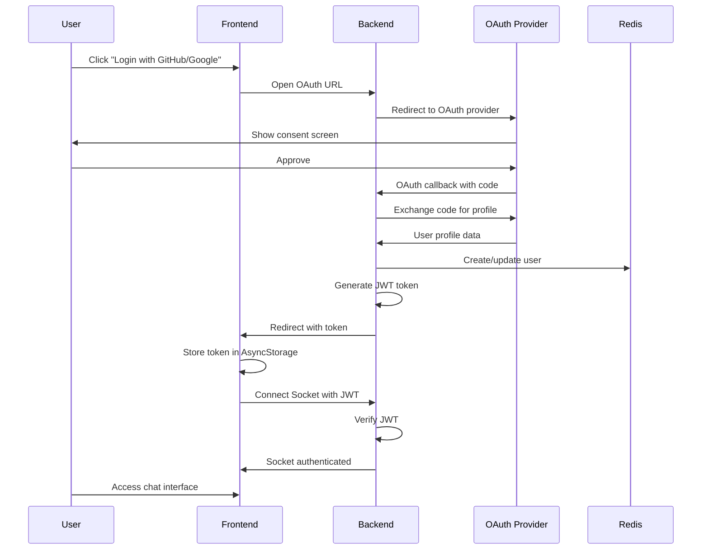
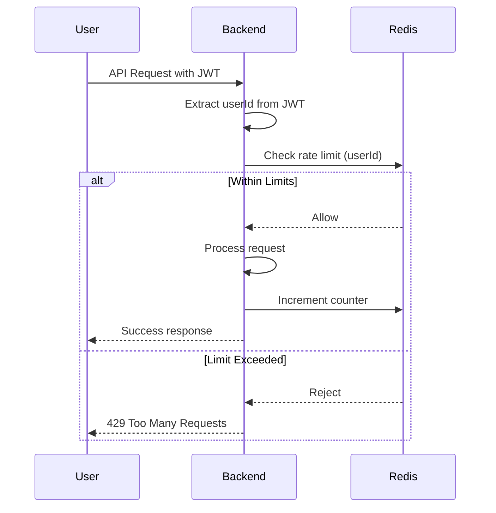

# Social Authentication & Rate Limiting Setup Guide

This guide explains how to configure and use the newly added social authentication (GitHub and Google) and rate limiting features.

## Overview

The application now requires users to authenticate via GitHub or Google OAuth before accessing the chat functionality. Rate limiting is enforced per authenticated user to protect against abuse while allowing normal usage.

## Rate Limits

### Authenticated Users
- **Chat Messages**: 50 messages per hour
- **API Requests**: 500 requests per hour
- **Socket Connections**: 20 connections per 5 minutes

### Unauthenticated (Auth Endpoints Only)
- **Authentication Attempts**: 10 requests per 15 minutes per IP

## Setup Instructions

### 1. Create OAuth Applications

#### GitHub OAuth App
1. Go to [GitHub Developer Settings](https://github.com/settings/developers)
2. Click "New OAuth App"
3. Fill in the details:
   - **Application name**: AI Chat Demo (or your choice)
   - **Homepage URL**: `http://localhost:19006` (for local development)
   - **Authorization callback URL**: `http://localhost:5001/api/auth/github/callback`
4. Click "Register application"
5. Copy the **Client ID** and **Client Secret**

#### Google OAuth App
1. Go to [Google Cloud Console](https://console.cloud.google.com/)
2. Create a new project or select an existing one
3. Navigate to "APIs & Services" > "Credentials"
4. Click "Create Credentials" > "OAuth client ID"
5. Configure consent screen if prompted
6. Select "Web application" as the application type
7. Add authorized redirect URIs:
   - `http://localhost:5001/api/auth/google/callback`
8. Copy the **Client ID** and **Client Secret**

### 2. Configure Backend Environment

Create or update `backend/.env` with your OAuth credentials:

```bash
# Copy from example
cp backend/.env.example backend/.env

# Edit backend/.env and add:
GITHUB_CLIENT_ID=your_github_client_id_here
GITHUB_CLIENT_SECRET=your_github_client_secret_here
GITHUB_CALLBACK_URL=http://localhost:5001/api/auth/github/callback

GOOGLE_CLIENT_ID=your_google_client_id_here
GOOGLE_CLIENT_SECRET=your_google_client_secret_here
GOOGLE_CALLBACK_URL=http://localhost:5001/api/auth/google/callback

# Generate strong secrets for production:
JWT_SECRET=your_secure_jwt_secret_here
SESSION_SECRET=your_secure_session_secret_here

# Redis URL (for rate limiting and user storage)
REDIS_URL=redis://localhost:6379

# Frontend URL (for OAuth redirects)
FRONTEND_URL=http://localhost:19006
```

### 3. Start Redis

Redis is required for user storage, session management, and rate limiting.

#### Using Docker Compose (Recommended)
```bash
docker-compose up redis -d
```

#### Using Local Redis
```bash
# macOS (Homebrew)
brew install redis
brew services start redis

# Ubuntu/Debian
sudo apt-get install redis-server
sudo systemctl start redis-server
```

### 4. Start the Application

#### Backend
```bash
cd backend
npm install  # Dependencies already installed
npm run dev
```

The backend will start on `http://localhost:5001`

#### Frontend
```bash
cd frontend
npm install  # Dependencies already installed
npm start
```

The frontend will start via Expo. You can:
- Press `i` for iOS Simulator
- Press `a` for Android Emulator
- Scan QR code with Expo Go app on your device

### 5. Test Authentication

1. Open the app (it will show the login screen)
2. Click "Continue with GitHub" or "Continue with Google"
3. Complete the OAuth flow in the browser
4. You'll be redirected back to the app, now authenticated
5. Try sending chat messages (you have 50 messages/hour)

## Architecture

### Backend Components

```
backend/src/
├── middleware/
│   ├── auth.ts              # JWT authentication middleware
│   └── rateLimit.ts         # Rate limiting with Redis store
├── routes/
│   └── auth.ts              # OAuth routes (/auth/github, /auth/google, etc.)
├── services/
│   └── authService.ts       # Passport strategies (GitHub, Google)
└── storage/
    └── userStorage.ts       # User CRUD with Redis
```

### Frontend Components

```
frontend/
├── app/
│   ├── auth/
│   │   ├── login.tsx        # Login screen with OAuth buttons
│   │   └── callback.tsx     # OAuth callback handler
│   └── _layout.tsx          # Auth protection & navigation
├── components/
│   └── AuthProvider.tsx     # React Context for auth state
└── services/
    ├── authService.ts       # Token storage, OAuth flow
    └── socketService.ts     # Socket.io with JWT auth
```

### Authentication Flow



### Rate Limiting Flow



## Monitoring

### Rate Limit Metrics

The system exposes Prometheus metrics for monitoring:

- `rl:api:{userId}` - API request counts per user
- `rl:chat:{userId}` - Chat message counts per user
- `rl:auth:{ip}` - Authentication attempts per IP
- `rl:socket:{userId}` - Socket connection attempts

### Viewing Metrics

```bash
# Start monitoring stack
docker-compose up prometheus grafana -d

# Access Grafana
open http://localhost:3000
# Login: admin / admin

# Access Prometheus
open http://localhost:9090
```

### Example Prometheus Queries

```promql
# Rate of API requests
rate(http_requests_total[5m])

# Rate limit rejections
rate(http_requests_total{status="429"}[5m])

# Active WebSocket connections
websocket_connections_active
```

## Troubleshooting

### "Authentication required" error on socket connection
- Ensure JWT token is being sent with socket connection
- Check that the token hasn't expired (7-day expiry by default)
- Verify Redis is running and accessible

### "No authentication token available" when connecting socket
- User may not be logged in
- Token may have been cleared from AsyncStorage
- Try logging out and logging in again

### Rate limit errors (429 Too Many Requests)
- You've exceeded the hourly limit
- Wait for the rate limit window to reset (shown in `Retry-After` header)
- For development, you can restart Redis to clear rate limit counters:
  ```bash
  docker-compose restart redis
  ```

### OAuth callback not working
- Verify OAuth app callback URLs match exactly
- Check that CLIENT_ID and CLIENT_SECRET are correct
- Ensure backend is accessible at the callback URL
- For mobile: ensure the `aichat://` scheme is registered

### Redis connection errors
- Ensure Redis is running: `docker-compose ps redis`
- Check REDIS_URL in backend/.env
- Try connecting manually: `redis-cli ping` (should return PONG)

## Production Deployment

### Security Checklist

- [ ] Generate strong random secrets for `JWT_SECRET` and `SESSION_SECRET`
- [ ] Use environment variables, never commit secrets to git
- [ ] Set `NODE_ENV=production`
- [ ] Enable HTTPS for all OAuth callback URLs
- [ ] Update OAuth app redirect URLs to production domains
- [ ] Configure `FRONTEND_URL` to production frontend URL
- [ ] Set `cookie.secure: true` in session configuration
- [ ] Consider implementing token refresh mechanism
- [ ] Set up Redis persistence (AOF or RDB)
- [ ] Configure Redis authentication
- [ ] Implement token blacklist for logout
- [ ] Add rate limiting for all endpoints
- [ ] Monitor rate limit metrics and adjust thresholds

### Environment Variables for Production

```bash
NODE_ENV=production
JWT_SECRET=<generate-strong-secret>
SESSION_SECRET=<generate-strong-secret>
GITHUB_CALLBACK_URL=https://your-domain.com/api/auth/github/callback
GOOGLE_CALLBACK_URL=https://your-domain.com/api/auth/google/callback
FRONTEND_URL=https://your-domain.com
REDIS_URL=redis://redis:6379
```

**Important:** The OAuth callback URLs must match exactly what you configure in your OAuth provider settings:

- **GitHub:** Settings → Developer settings → OAuth Apps → Your App → Authorization callback URL
- **Google:** Google Cloud Console → APIs & Services → Credentials → Your OAuth 2.0 Client → Authorized redirect URIs

**Common Issue:** If callbacks go to `localhost:5001` in production, verify:
1. Environment variables are set correctly in your deployment (Kubernetes ConfigMap, Docker Compose, etc.)
2. OAuth provider settings use the production domain (not localhost)
3. The backend is reading the correct environment variables (check logs on startup)

### Generating Secrets

```bash
# Generate random secrets (Node.js)
node -e "console.log(require('crypto').randomBytes(64).toString('hex'))"

# Or using OpenSSL
openssl rand -hex 64
```

## API Endpoints

### Authentication Endpoints

| Endpoint | Method | Description | Auth Required |
|----------|--------|-------------|---------------|
| `/api/auth/github` | GET | Initiate GitHub OAuth | No |
| `/api/auth/github/callback` | GET | GitHub OAuth callback | No |
| `/api/auth/google` | GET | Initiate Google OAuth | No |
| `/api/auth/google/callback` | GET | Google OAuth callback | No |
| `/api/auth/me` | GET | Get current user profile | Yes |
| `/api/auth/logout` | POST | Logout user | No |

### Protected Endpoints

All other API endpoints now require authentication via `Authorization: Bearer <token>` header:

- `/api/chat` - Chat endpoints (+ chat rate limiting)
- `/api/conversations` - Conversation management
- `/api/reactions` - Message reactions
- `/api/validation` - Validation logs
- `/api/test-bench` - Agent testing
- `/api/queue` - Message queue management

### WebSocket Authentication

Socket.io connections require authentication:

```javascript
const socket = io('http://localhost:5001', {
  auth: {
    token: 'your-jwt-token-here'
  }
});
```

## Development Tips

### Testing Without OAuth Setup

For quick local testing without setting up OAuth apps:

1. Comment out the auth middleware temporarily in `backend/src/index.ts`
2. Comment out auth check in socket handler `backend/src/socket/socketHandlers.ts`
3. Comment out auth redirect in frontend `_layout.tsx`

**Note**: This is only for initial development. Re-enable auth before committing.

### Clearing User Data

```bash
# Clear all users from Redis
redis-cli FLUSHDB

# Clear specific user
redis-cli DEL "user:<user-id>"
redis-cli DEL "provider:github:<provider-id>"
```

### Adjusting Rate Limits

Edit `backend/src/middleware/rateLimit.ts`:

```typescript
// Increase chat limit to 100 messages/hour
export const chatRateLimiter = rateLimit({
  windowMs: 60 * 60 * 1000,
  max: 100, // Changed from 50
  // ...
});
```

## Support & Documentation

- **Full API Documentation**: http://localhost:5001/docs (when backend is running)
- **Architecture Documentation**: See `docs/` directory
- **GitHub Issues**: Report bugs or request features

## License

MIT
