# Demo Portfolio: AI + Modern Web Engineering Patterns

[](https://github.com/ianlintner/Example-React-AI-Chat-App/actions/workflows/ci-optimized.yml)


A portfolio-ready demo that showcases current, high‑impact technologies and architectural patterns for building AI‑enabled, real‑time applications. This repository is intentionally designed for hands‑on demos, interviews, workshops, and code reviews.

- Modern mobile client (React Native + Expo) with real‑time UX
- Multi‑agent AI orchestration, goal‑seeking, and RAG
- Production‑style quality gates: validation, tracing, metrics
- Observable by default: Prometheus, Grafana, Jaeger, OpenTelemetry
- TypeScript end‑to‑end, CI quality checks, and comprehensive tests

> This is not a product; it’s a demo portfolio project to illustrate patterns, tradeoffs, and implementation details that matter in AI and modern web engineering.

## What This Demonstrates

- AI patterns: multi‑agent routing, goal‑seeking loops, RAG content, safety/validation
- Systems patterns: evented messaging, WebSocket streaming, backpressure awareness
- Reliability patterns: structured logging, metrics, traces, dashboards
- Delivery patterns: consistent TypeScript, test pyramid, CI quality gates
- Developer experience: clear module boundaries, docs, and demo scenarios

## 🚀 Quick Start

### Prerequisites

- Node.js 18+
- npm or yarn
- Expo CLI: `npm i -g @expo/cli`
- Optional: OpenAI API key (demo works without via RAG + stubs)
- Optional: Docker (for the monitoring stack)

### Setup

```bash
# 1) Install dependencies
cd backend && npm install
cd ../frontend && npm install

# 2) Configure environment (OpenAI key optional for demo)
cp backend/.env.example backend/.env
# Add your OpenAI API key to backend/.env if you want live model calls

# 3) Run the demo
# Terminal 1
cd backend && npm run dev

# Terminal 2
cd frontend && npm start    # Expo: press i for iOS simulator or scan QR with Expo Go
```

### Access Points

- 📱 Mobile App: Start Expo, press i for iOS simulator or scan QR with Expo Go
- 📖 API Docs: http://localhost:3000/api/docs
- 📊 Monitoring (Grafana): http://localhost:5001
- 📈 Metrics (Prometheus): http://localhost:9090
- 🔍 Tracing (Jaeger): http://localhost:16686

### Monitoring Stack (optional)

```bash
docker-compose up
```

## Suggested 10‑Minute Walkthrough

1. Chat + Agents

- Launch the app with Expo.
- Send a few messages and observe multi‑agent routing and goal‑seeking behavior.

2. Validation & Quality

- Trigger responses that exercise the validation layer (safe/unsafe, structure).
- Review validation results in the API responses and logs.

3. Observability Tour

- Open Grafana dashboards and Jaeger traces while interacting with the app.
- Show request/response timings, agent selection latency, and validation metrics.

4. RAG Demo (No API Key)

- Run without an OpenAI key to demonstrate curated RAG responses and offline behavior.

## Architecture (High‑Level)

```mermaid
graph TB
  subgraph Mobile
    RN[React Native + Expo<br/>Socket.io Client]
  end

  subgraph API/Backend
    GW[Express 5 REST + WebSocket]
    MQ[Message Queue]
    ROUTER[Agent Router]
    GOALS[Goal‑Seeking System]
    VALID[Response Validation]
    RAG[(RAG Content)]
  end

  subgraph Observability
    OTEL[OpenTelemetry]
    PROM[Prometheus]
    GRAF[Grafana]
    JAEGER[Jaeger]
  end

  RN --> GW
  GW --> ROUTER --> GOALS
  GOALS --> MQ
  GOALS --> RAG
  VALID --> PROM
  GW --> OTEL --> JAEGER
  PROM --> GRAF
```



## Tech Highlights

Frontend (React Native + Expo)

- TypeScript, Expo Router, Socket.io Client
- Componentized UI and demo‑first screens
- Jest + React Native Testing Library

Backend (Node.js + Express)

- TypeScript, Express 5, Socket.io Server
- Agent orchestration, classification, goal‑seeking loop
- RAG content, validation/safety gates
- In‑memory storage (demo‑friendly), Mongo/Postgres ready

Observability & Ops

- OpenTelemetry tracing
- Prometheus metrics + Grafana dashboards
- Jaeger distributed tracing
- Docker Compose for local ops demo

CI/Quality

- Jest unit/integration tests
- ESLint + Prettier
- GitHub Actions workflows

## Repository Map

```
├── backend/                 # Node backend (TS, Express, Socket.io)
│   ├── src/agents/          # Classification, routing, goal‑seeking, RAG
│   ├── src/routes/          # REST + WebSocket endpoints
│   ├── src/validation/      # Response validation & safety
│   ├── src/tracing/         # Tracing & context helpers
│   └── src/metrics/         # Prometheus metrics
├── frontend/                # React Native (Expo, TS)
│   ├── app/                 # Screens & navigation (Expo Router)
│   ├── components/          # Reusable UI components
│   └── services/            # API + socket services
├── docs/                    # Documentation (architecture, ops, testing)
├── grafana/                 # Dashboards provisioned for demo
└── docker-compose.yml       # Monitoring stack (Prometheus, Grafana, Jaeger)
```

## Documentation

- Architecture Guide: ./docs/architecture.md
- Documentation Index: ./docs/INDEX.md
- Agents: ./docs/agents.md
- Goal‑Seeking System: ./docs/goal-seeking-system.md
- Observability & Monitoring: ./docs/observability-monitoring.md
- Backend Guide: ./docs/backend.md
- Frontend Guide: ./docs/frontend.md
- Testing & CI: ./docs/testing-and-ci.md

## Notes & Non‑Goals

- This repo prioritizes demonstrating patterns over completeness.
- Storage is in‑memory by default for a frictionless demo.
- Security controls illustrate approaches; hardening for production is out of scope.
- Cloud deployment manifests are intentionally minimal.

## License

MIT — see LICENSE.

Built to demonstrate pragmatic, modern AI + web engineering patterns with clarity and traceability.
