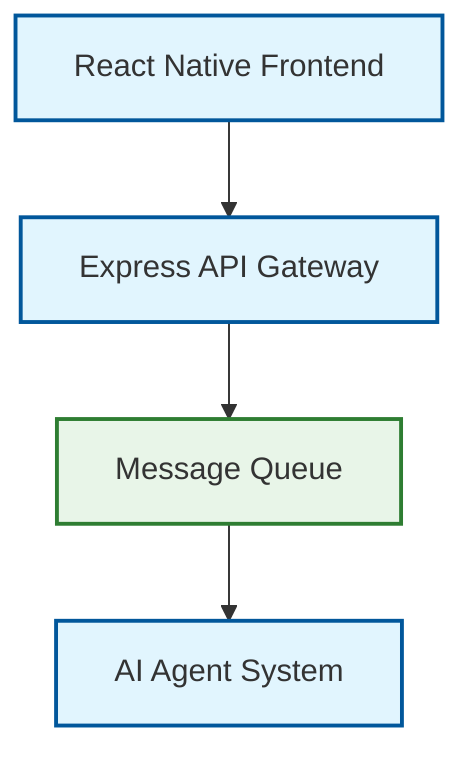

# Documentation Standardization Plan
*Principal Engineer Assessment & Implementation Strategy*

## Executive Summary

This plan standardizes the documentation architecture following engineering best practices, addressing information architecture, content quality, tooling, and governance.

**Current State:**
- MkDocs with TechDocs integration ✅
- Well-organized navigation structure ✅
- Comprehensive content coverage ✅
- Some legacy/duplicate content requiring consolidation ⚠️
- Missing standardized templates and style guides ❌

**Target State:**
- Unified IA with clear user journeys
- Standardized content templates and style guide
- Enhanced tooling for quality gates
- Clear governance and maintenance workflows

## 1. Information Architecture (IA) Improvements

### 1.1 Navigation Optimization
**Current:** Adequate structure with 6 main sections
**Target:** Optimize for user journeys and reduce cognitive load

```yaml
# Proposed mkdocs.yml nav structure
nav:
  - Home: index.md
  - Getting Started:
      - Overview: getting-started/index.md
      - Quick Start: getting-started/quickstart.md
      - Development Setup: getting-started/setup.md
      - Troubleshooting: getting-started/troubleshooting.md
  - Architecture:
      - Overview: architecture/index.md
      - System Design: architecture/system-overview.md
      - Components:
          - Agent System: architecture/components/agents.md
          - Message Queue: architecture/components/message-queue.md
          - Validation Pipeline: architecture/components/validation-system.md
          - RAG System: architecture/components/rag-system.md
      - Technical Decisions: architecture/decisions/
  - Developer Guide:
      - API Reference: reference/api-reference.md
      - Code Quality Standards: reference/code-quality.md
      - Testing Strategy: reference/testing.md
  - Operations:
      - Observability: operations/observability.md
      - CI/CD: operations/ci-cd.md
      - Monitoring: operations/prometheus-grafana.md
      - Tracing: operations/tracing.md
  - Examples:
      - Integration Examples: examples/external-app.md
      - Code Samples: examples/code-samples.md
```

### 1.2 Content Consolidation
**Legacy files to consolidate:**
- `docs/backend.md` → Merge into `architecture/components/`
- `docs/api-reference.md` → Consolidate with `reference/api-reference.md`
- `docs/architecture.md` → Merge into `architecture/system-overview.md`
- `docs/system-summary.md` → Content to `architecture/index.md`

## 2. Content Standards & Templates

### 2.1 Writing Style Guide
- **Voice:** Professional, concise, action-oriented
- **Tense:** Present tense for descriptions, imperative for instructions
- **Structure:** Lead with key information, support with details
- **Code Examples:** Always runnable and minimal

### 2.2 Page Templates

#### Architecture Decision Record (ADR) Template
```markdown
# ADR-001: [Decision Title]

## Status
[Proposed | Accepted | Deprecated | Superseded]

## Context
[Business/technical context]

## Decision
[The decision made]

## Consequences
[Positive and negative consequences]

## Implementation Notes
[Technical details, migration steps]
```

#### How-To Guide Template
```markdown
# How to [Accomplish Task]

## Overview
[Brief description and use case]

## Prerequisites
- [Requirement 1]
- [Requirement 2]

## Steps
1. [Action step with code example]
2. [Next action]

## Verification
[How to confirm success]

## Troubleshooting
[Common issues and solutions]

## Related
- [Link to related docs]
```

#### Component Documentation Template
```markdown
# [Component Name]

## Overview
[High-level description and purpose]

## Architecture
[Diagram and key concepts]

## Configuration
[Configuration options and examples]

## API Reference
[If applicable]

## Integration Points
[How it connects to other components]

## Troubleshooting
[Common issues and debugging]
```

### 2.3 Diagram Standards

#### Mermaid Best Practices


**Standards:**
- Always include legend for colors/symbols
- Use consistent direction (TB or LR)
- Keep diagrams focused (max 10-15 nodes)
- Include title and context

## 3. Technical Implementation

### 3.1 Enhanced MkDocs Configuration
```yaml
# Proposed mkdocs.yml enhancements
site_name: AI Chat Demo - Technical Documentation
site_description: Enterprise-grade AI chat application documentation

# SEO and metadata
site_author: Engineering Team
site_url: http://example-docs.hugecat.net/

# Enhanced theme configuration
theme:
  name: material
  features:
    - navigation.indexes
    - navigation.top
    - navigation.tabs
    - search.highlight
    - search.share
    - toc.follow
  palette:
    - scheme: default
      primary: blue
      accent: light blue
      toggle:
        icon: material/brightness-7
        name: Switch to dark mode
    - scheme: slate
      primary: blue
      accent: light blue
      toggle:
        icon: material/brightness-4
        name: Switch to light mode

# Enhanced plugins
plugins:
  - techdocs-core
  - search:
      lang: en
  - git-revision-date-localized:
      type: date
  - minify:
      minify_html: true

# Enhanced markdown extensions
markdown_extensions:
  - admonition
  - attr_list
  - def_list
  - footnotes
  - md_in_html
  - toc:
      permalink: "¤"
      toc_depth: 3
  - pymdownx.betterem
  - pymdownx.details
  - pymdownx.highlight:
      anchor_linenums: true
  - pymdownx.inlinehilite
  - pymdownx.keys
  - pymdownx.mark
  - pymdownx.smartsymbols
  - pymdownx.snippets
  - pymdownx.superfences:
      custom_fences:
        - name: mermaid
          class: mermaid
          format: !!python/name:pymdownx.superfences.fence_code_format
  - pymdownx.tabbed:
      alternate_style: true
  - pymdownx.tasklist:
      custom_checkbox: true
  - tables

# Enable strict mode for link checking
strict: true
```

### 3.2 Quality Gates

#### Linting Configuration
```yaml
# .markdownlint.yml
extends: markdownlint/style/prettier
rules:
  MD013: false  # Line length - handled by prettier
  MD033: false  # Allow inline HTML for advanced formatting
  MD041: false  # First line doesn't need to be H1 (for templates)
  MD046:        # Code block style
    style: fenced
```

#### Spell Check Configuration
```json
// cspell.json
{
  "version": "0.2",
  "language": "en",
  "words": [
    "mkdocs",
    "mermaid",
    "openapi",
    "grafana",
    "prometheus",
    "jaeger",
    "techdocs",
    "backstage",
    "fastapi",
    "websocket",
    "socketio"
  ],
  "ignorePaths": [
    "node_modules/**",
    "*.log",
    "*.json"
  ]
}
```

### 3.3 CI/CD Integration

#### Enhanced GitHub Actions Workflow
```yaml
# .github/workflows/docs-quality.yml
name: Documentation Quality

on:
  pull_request:
    paths: ['docs/**', 'mkdocs.yml', '*.md']
  push:
    branches: [main, develop]
    paths: ['docs/**', 'mkdocs.yml', '*.md']

jobs:
  docs-quality:
    runs-on: ubuntu-latest
    steps:
      - uses: actions/checkout@v4
      
      - name: Setup Python
        uses: actions/setup-python@v4
        with:
          python-version: '3.11'
          
      - name: Install dependencies
        run: |
          pip install mkdocs-material mkdocs-git-revision-date-localized-plugin
          pip install mkdocs-minify-plugin
          npm install -g markdownlint-cli2 cspell
          
      - name: Lint markdown
        run: markdownlint-cli2 "docs/**/*.md" "*.md"
        
      - name: Spell check
        run: cspell "docs/**/*.md" "*.md"
        
      - name: Build docs (strict mode)
        run: mkdocs build --strict
        
      - name: Test links
        run: |
          pip install linkchecker
          mkdocs serve --dev-addr=localhost:8000 &
          sleep 10
          linkchecker http://localhost:8000 --ignore-url="localhost:3000|localhost:9090"
```

## 4. Governance & Maintenance

### 4.1 Documentation Ownership
- **Owner:** Platform Engineering Team
- **Contributors:** All engineering teams
- **Review Process:** Required for architecture changes, optional for minor updates

### 4.2 Review Guidelines
- Architecture changes require principal engineer review
- API changes require team lead review
- Editorial changes can be self-merged after CI passes

### 4.3 Maintenance Cadence
- **Quarterly Review:** Audit for outdated content, broken links
- **Release Cycle:** Update with major feature releases
- **Continuous:** Fix issues identified by CI/CD

### 4.4 Metrics & Success Criteria
- **Link Health:** <1% broken internal links
- **Search Usage:** Track most-searched terms
- **Feedback:** User satisfaction surveys
- **Adoption:** Developer usage analytics

## 5. Implementation Roadmap

### Phase 1: Foundation (Week 1-2)
- [x] Add live docs link to README
- [x] Configure mermaid rendering without syntax highlighting
- [x] Exclude docs from Prettier formatting
- [ ] Implement enhanced mkdocs.yml configuration
- [ ] Add markdown linting rules
- [ ] Create content templates

### Phase 2: Content Optimization (Week 3-4)
- [ ] Consolidate legacy documentation
- [ ] Implement new navigation structure
- [ ] Standardize existing diagrams
- [ ] Add missing architecture decisions

### Phase 3: Quality Gates (Week 5)
- [ ] Implement spell checking
- [ ] Add link validation
- [ ] Deploy enhanced CI/CD pipeline
- [ ] Add PR preview functionality

### Phase 4: Governance (Week 6)
- [ ] Establish review processes
- [ ] Set up metrics collection
- [ ] Create contributor guidelines
- [ ] Launch documentation portal

## 6. Success Metrics

### Quantitative
- **Build Success Rate:** >95% successful doc builds
- **Link Health:** <1% broken links
- **Search Performance:** <2s average search response
- **Content Freshness:** >90% of docs updated within 6 months

### Qualitative
- **Developer Experience:** Positive feedback from user surveys
- **Onboarding Efficiency:** Reduced time-to-productivity for new developers
- **Decision Traceability:** Clear path from requirements to implementation

---

## Appendix

### A. Current File Audit
- **Total Pages:** ~25 markdown files
- **Orphaned Content:** backend.md, api-reference.md (root), architecture.md (root)
- **Missing Content:** Testing guides, deployment runbooks, security guidelines
- **Diagram Coverage:** ~40% of architecture concepts have diagrams

### B. Tool Requirements
- Python 3.11+ for MkDocs
- Node.js 18+ for linting tools
- GitHub Actions for CI/CD
- Optional: Docker for local preview

### C. Reference Links
- [MkDocs Material Documentation](https://squidfunk.github.io/mkdocs-material/)
- [Backstage TechDocs](https://backstage.io/docs/features/techdocs/)
- [Diátaxis Documentation Framework](https://diataxis.fr/)
