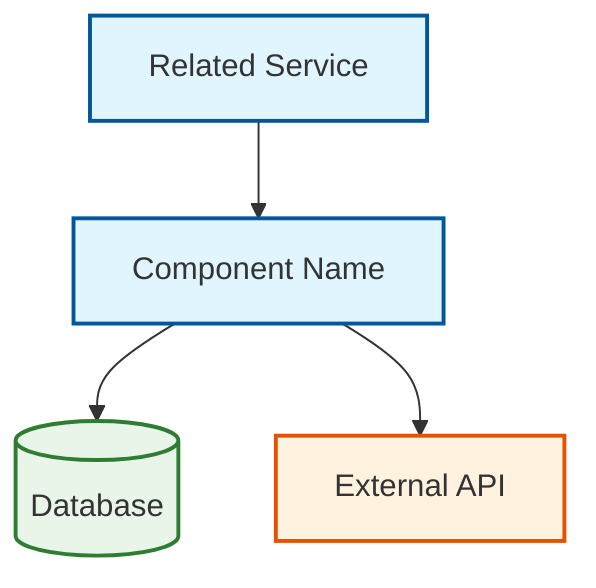

# [Component Name]

**Type:** [Service | Library | Database | External System]

**Status:** [Active | Deprecated | Experimental]

**Owner:** [Team/Individual]

**Last Updated:** [YYYY-MM-DD]

## Overview

[High-level description of the component's purpose and role in the system. Include:]

- Primary responsibility
- Key capabilities
- Position in the overall architecture

## Architecture

[Include a Mermaid diagram showing the component's position and relationships]



### Key Concepts

- **[Concept 1]:** Brief explanation
- **[Concept 2]:** Brief explanation
- **[Concept 3]:** Brief explanation

## Configuration

### Environment Variables

| Variable | Required | Default | Description |
|----------|----------|---------|-------------|
| `CONFIG_NAME` | Yes | - | Purpose and expected values |
| `OPTIONAL_CONFIG` | No | `default` | Optional configuration |

### Example Configuration

```yaml
# docker-compose.yml or configuration file
component:
  config_name: "production_value"
  optional_config: "custom_value"
  nested:
    option: true
```

## API Reference

### Endpoints (if applicable)

#### `GET /api/endpoint`

**Description:** What this endpoint does

**Parameters:**
- `param1` (string, required): Description
- `param2` (integer, optional): Description

**Response:**
```json
{
  "status": "success",
  "data": {
    "result": "example"
  }
}
```

### Events (if applicable)

#### `component.event.name`

**Triggered when:** Condition that triggers this event

**Payload:**
```json
{
  "eventType": "component.event.name",
  "timestamp": "2024-01-01T00:00:00Z",
  "data": {
    "key": "value"
  }
}
```

## Integration Points

### Dependencies

- **[Service/Component Name]:** Why it's needed and how it's used
- **[Database Name]:** Data stored and access patterns
- **[External API]:** Integration purpose and fallback behavior

### Dependent Services

- **[Service Name]:** How this service depends on our component
- **[Another Service]:** Integration details

## Monitoring & Observability

### Key Metrics

- `component_requests_total`: Total requests processed
- `component_errors_total`: Error count by type
- `component_duration_seconds`: Request duration histogram

### Health Checks

```bash
# Health check endpoint
curl http://localhost:PORT/health

# Expected response
{
  "status": "healthy",
  "checks": {
    "database": "ok",
    "external_api": "ok"
  }
}
```

### Logs

Key log events and their formats:

```json
{
  "level": "info",
  "timestamp": "2024-01-01T00:00:00Z",
  "component": "component-name",
  "message": "Operation completed",
  "metadata": {
    "operation_id": "uuid",
    "duration_ms": 150
  }
}
```

## Development

### Local Development

```bash
# Clone and setup
git clone [repository]
cd component-name
npm install

# Run locally
npm run dev

# Run tests
npm test
```

### Testing Strategy

- **Unit Tests:** Component logic and business rules
- **Integration Tests:** Database and external API interactions
- **Contract Tests:** API endpoint contracts

## Deployment

### Build Process

```dockerfile
# Dockerfile example
FROM node:18-alpine
WORKDIR /app
COPY package*.json ./
RUN npm ci --only=production
COPY . .
EXPOSE 3000
CMD ["npm", "start"]
```

### Environment-Specific Notes

- **Development:** Special configuration or setup
- **Staging:** Differences from production
- **Production:** Critical deployment considerations

## Troubleshooting

### Common Issues

#### Issue: [Problem Description]

**Symptoms:**
- Error messages or behaviors
- When it typically occurs

**Diagnosis:**
```bash
# Commands to diagnose the issue
kubectl logs component-name
curl -v http://localhost:PORT/health
```

**Resolution:**
1. Step to resolve
2. Configuration change needed
3. Restart procedure if required

### Performance Issues

- **High CPU Usage:** Likely causes and solutions
- **Memory Leaks:** Detection and mitigation
- **Slow Responses:** Optimization strategies

## Security Considerations

- **Authentication:** How the component authenticates
- **Authorization:** Permission model
- **Data Protection:** Sensitive data handling
- **Network Security:** Firewall rules and encryption

## Runbooks

### Scaling

```bash
# Horizontal scaling
kubectl scale deployment component-name --replicas=5

# Vertical scaling considerations
# Update resource limits in deployment config
```

### Backup & Recovery

- **Data Backup:** What data needs backing up
- **Recovery Process:** Steps to restore from backup
- **RTO/RPO:** Target recovery time and data loss limits

## Related Documentation

- [System Architecture Overview](../architecture/system-overview.md)
- [Related Component Documentation](../architecture/components/agents.md)
- [API Reference](../reference/api-reference.md)
- [Operations Runbook](../operations/runbooks.md)

---

## Template Usage

1. Copy this template to `docs/architecture/components/`
2. Rename with component name: `[component-name].md`
3. Fill in all relevant sections (remove sections that don't apply)
4. Add diagrams showing component relationships
5. Test all code examples and commands
6. Add to navigation in `mkdocs.yml`
7. Submit for review (architecture components require review)
