# Multi-Agent System

## Overview

The Multi-Agent System provides intelligent orchestration of specialized AI agents, each optimized for specific domains such as entertainment, support, and general assistance. The system includes sophisticated goal-seeking capabilities, proactive messaging, conversation continuity, and intelligent agent handoffs to create seamless user experiences.

## Architecture

```mermaid
graph TB
    subgraph "Multi-Agent System Architecture"
        Input[User Message] --> AgentService[Agent Service]
        
        subgraph "Core Orchestration"
            AgentService --> Classifier[Message Classifier]
            AgentService --> GoalSeeker[Goal-Seeking System]
            AgentService --> ConversationMgr[Conversation Manager]
            AgentService --> ValidationSvc[Response Validator]
        end
        
        subgraph "Agent Classification"
            Classifier --> GeneralAgent[General Assistant<br/>🤖 General conversation]
            Classifier --> JokeAgent[Adaptive Joke Master<br/>😄 Learning humor]
            Classifier --> TriviaAgent[Trivia Master<br/>🧠 Knowledge sharing]
            Classifier --> GIFAgent[GIF Master<br/>🎬 Visual entertainment]
            Classifier --> DnDAgent[D&D Master<br/>🎲 RPG experiences]
            Classifier --> SupportAgents[Support Specialists<br/>🎧 Customer service]
        end
        
        subgraph "Processing Pipeline"
            GeneralAgent --> OpenAI[OpenAI API<br/>GPT-4 Integration]
            JokeAgent --> OpenAI
            TriviaAgent --> OpenAI
            GIFAgent --> OpenAI
            DnDAgent --> OpenAI
            SupportAgents --> OpenAI
            
            OpenAI --> RAGService[RAG Service<br/>Curated content fallback]
            RAGService --> ResponseGen[Response Generation]
            ResponseGen --> ValidationSvc
        end
        
        subgraph "Advanced Features"
            GoalSeeker --> ProactiveActions[Proactive Actions<br/>🎯 Goal-driven messaging]
            ConversationMgr --> AgentHandoffs[Smart Agent Handoffs<br/>🔄 Context-aware transitions]
            ValidationSvc --> QualityScoring[Quality Scoring<br/>📊 Response validation]
        end
        
        subgraph "Output & Monitoring"
            ProactiveActions --> SocketHandler[Socket Handler]
            AgentHandoffs --> SocketHandler
            QualityScoring --> UserResponse[User Response]
            UserResponse --> Metrics[Prometheus Metrics]
            UserResponse --> Tracing[OpenTelemetry Traces]
        end
    end

    classDef service fill:#e1f5fe,stroke:#01579b,color:#000
    classDef data fill:#e8f5e8,stroke:#2e7d32,color:#000
    classDef external fill:#fff3e0,stroke:#ef6c00,color:#000
    classDef agent fill:#f3e5f5,stroke:#7b1fa2,color:#000
    classDef feature fill:#e8eaf6,stroke:#3f51b5,color:#000
    
    class AgentService,Classifier,GoalSeeker,ConversationMgr,ValidationSvc service
    class RAGService,ResponseGen,Metrics,Tracing data
    class Input,OpenAI,SocketHandler external
    class GeneralAgent,JokeAgent,TriviaAgent,GIFAgent,DnDAgent,SupportAgents agent
    class ProactiveActions,AgentHandoffs,QualityScoring feature
```



## Agent Classification System


## Goal-Seeking System

```mermaid
graph TB
    subgraph "Goal-Seeking Architecture"
        UserMessage[User Message] --> StateUpdater[User State Updater]
        
        subgraph "Goal Management"
            StateUpdater --> GoalActivator[Goal Activator]
            GoalActivator --> EntertainmentGoal[Entertainment Goals<br/>🎭 Engagement & fun]
            GoalActivator --> SupportGoal[Support Goals<br/>🎧 Problem resolution]
            GoalActivator --> EngagementGoal[Engagement Goals<br/>💬 Conversation continuity]
        end
        
        subgraph "Proactive Action Generation"
            EntertainmentGoal --> ActionGen[Action Generator]
            SupportGoal --> ActionGen
            EngagementGoal --> ActionGen
            
            ActionGen --> ImmediateActions[Immediate Actions<br/>⚡ Real-time responses]
            ActionGen --> DelayedActions[Delayed Actions<br/>⏱️ Scheduled follow-ups]
            ActionGen --> ConditionalActions[Conditional Actions<br/>🎯 Context-triggered]
        end
        
        subgraph "Single-Agent Control"
            ImmediateActions --> ActiveCheck{Agent<br/>Active?}
            DelayedActions --> ActiveCheck
            ConditionalActions --> ActiveCheck
            
            ActiveCheck -->|Yes| ActionQueue[Action Queue<br/>📋 Pending actions]
            ActiveCheck -->|No| Execute[Execute Action<br/>✅ Agent activation]
        end
        
        subgraph "Action Types"
            Execute --> TechCheck[Technical Check<br/>🔧 Follow-up support]
            Execute --> EntertainOffer[Entertainment Offer<br/>🎪 Fun suggestions]
            Execute --> StatusUpdate[Status Update<br/>📊 Progress reports]
            Execute --> AgentSwitch[Agent Switch<br/>🔄 Context handoff]
        end
        
        subgraph "Feedback Loop"
            TechCheck --> ProgressUpdate[Goal Progress Update]
            EntertainOffer --> ProgressUpdate
            StatusUpdate --> ProgressUpdate
            AgentSwitch --> ProgressUpdate
            
            ProgressUpdate --> StateUpdater
        end
    end

    classDef service fill:#e1f5fe,stroke:#01579b,color:#000
    classDef data fill:#e8f5e8,stroke:#2e7d32,color:#000
    classDef external fill:#fff3e0,stroke:#ef6c00,color:#000
    classDef goal fill:#f3e5f5,stroke:#7b1fa2,color:#000
    classDef action fill:#e8eaf6,stroke:#3f51b5,color:#000
    
    class StateUpdater,GoalActivator,ActionGen,ActiveCheck,Execute,ProgressUpdate service
    class ActionQueue,TechCheck,EntertainOffer,StatusUpdate,AgentSwitch data
    class UserMessage external
    class EntertainmentGoal,SupportGoal,EngagementGoal goal
    class ImmediateActions,DelayedActions,ConditionalActions action
```



## Conversation Management & Agent Handoffs


## Specialized Agents

### Entertainment Agents

```mermaid
graph TB
    subgraph "Entertainment Agent Ecosystem"
        UserRequest[Entertainment Request] --> Router[Agent Router]
        
        subgraph "Core Entertainment Agents"
            Router --> JokeAgent[Adaptive Joke Master<br/>😄 Learning humor system]
            Router --> TriviaAgent[Trivia Master<br/>🧠 Knowledge & facts]
            Router --> GIFAgent[GIF Master<br/>🎬 Visual entertainment]
            Router --> DnDAgent[D&D Master<br/>🎲 RPG experiences]
        end
        
        subgraph "Specialized Features"
            JokeAgent --> LearningSystem[Joke Learning System<br/>📈 Adaptive humor]
            TriviaAgent --> KnowledgeBase[Curated Facts<br/>🏛️ Quality content]
            GIFAgent --> VisualSearch[Visual Content<br/>🖼️ Curated GIFs]
            DnDAgent --> RPGEngine[RPG Engine<br/>⚔️ Character & dice systems]
        end
        
        subgraph "Enhancement Systems"
            LearningSystem --> RAGFallback[RAG Content Fallback<br/>📚 Curated responses]
            KnowledgeBase --> RAGFallback
            VisualSearch --> RAGFallback
            RPGEngine --> RAGFallback
            
            RAGFallback --> QualityFilter[Quality Validation<br/>✅ Response scoring]
        end
        
        subgraph "User Experience"
            QualityFilter --> PersonalizedResponse[Personalized Response<br/>🎯 Tailored to user]
            PersonalizedResponse --> EngagementLoop[Engagement Loop<br/>🔄 Continued interaction]
        end
    end

    classDef service fill:#e1f5fe,stroke:#01579b,color:#000
    classDef data fill:#e8f5e8,stroke:#2e7d32,color:#000
    classDef external fill:#fff3e0,stroke:#ef6c00,color:#000
    classDef agent fill:#f3e5f5,stroke:#7b1fa2,color:#000
    classDef feature fill:#e8eaf6,stroke:#3f51b5,color:#000
    
    class Router,QualityFilter service
    class LearningSystem,KnowledgeBase,VisualSearch,RPGEngine,RAGFallback data
    class UserRequest,PersonalizedResponse,EngagementLoop external
    class JokeAgent,TriviaAgent,GIFAgent,DnDAgent agent
```



### Support Agents

```mermaid
graph TB
    subgraph "Support Agent Specialization"
        SupportRequest[Support Request] --> SupportClassifier[Support Classifier]
        
        subgraph "Specialized Support Agents"
            SupportClassifier --> AccountAgent[Account Support<br/>👤 User authentication]
            SupportClassifier --> BillingAgent[Billing Support<br/>💳 Financial matters]
            SupportClassifier --> WebsiteAgent[Website Issues<br/>🌐 Technical problems]
            SupportClassifier --> OperatorAgent[Customer Operator<br/>📞 General coordination]
            SupportClassifier --> HoldAgent[Hold Agent<br/>⏰ Wait management]
        end
        
        subgraph "Support Capabilities"
            AccountAgent --> AuthSolutions[Authentication Solutions<br/>🔐 Login & security]
            BillingAgent --> PaymentSolutions[Payment Solutions<br/>💰 Billing & refunds]
            WebsiteAgent --> TechSolutions[Technical Solutions<br/>⚙️ Performance & bugs]
            OperatorAgent --> RoutingSolutions[Routing Solutions<br/>🎯 Issue coordination]
            HoldAgent --> WaitSolutions[Wait Solutions<br/>🎵 Entertainment & updates]
        end
        
        subgraph "Escalation & Handoffs"
            AuthSolutions --> EscalationLogic[Escalation Logic]
            PaymentSolutions --> EscalationLogic
            TechSolutions --> EscalationLogic
            RoutingSolutions --> EscalationLogic
            WaitSolutions --> EscalationLogic
            
            EscalationLogic --> SmartRouting[Smart Agent Routing<br/>🧠 Intelligent handoffs]
        end
        
        subgraph "Resolution Tracking"
            SmartRouting --> ResolutionTracking[Resolution Tracking<br/>📊 Issue progress]
            ResolutionTracking --> SatisfactionMetrics[Satisfaction Metrics<br/>📈 Quality measurement]
        end
    end

    classDef service fill:#e1f5fe,stroke:#01579b,color:#000
    classDef data fill:#e8f5e8,stroke:#2e7d32,color:#000
    classDef external fill:#fff3e0,stroke:#ef6c00,color:#000
    classDef agent fill:#f3e5f5,stroke:#7b1fa2,color:#000
    classDef feature fill:#e8eaf6,stroke:#3f51b5,color:#000
    
    class SupportClassifier,EscalationLogic,SmartRouting service
    class AuthSolutions,PaymentSolutions,TechSolutions,RoutingSolutions,WaitSolutions,ResolutionTracking,SatisfactionMetrics data
    class SupportRequest external
    class AccountAgent,BillingAgent,WebsiteAgent,OperatorAgent,HoldAgent agent
```



## Core Components

### Agent Service (`backend/src/agents/agentService.ts`)

The central orchestration service that coordinates all agent interactions:

- **Multi-Agent Processing**: Classifies messages and routes to appropriate agents
- **Goal-Seeking Integration**: Manages proactive actions and user state tracking  
- **Conversation Continuity**: Maintains context across interactions and agent handoffs
- **Response Validation**: Ensures quality and appropriateness of all responses
- **Single-Agent Control**: Prevents conflicts with queue-based action management

### Message Classifier (`backend/src/agents/classifier.ts`)

Intelligent message classification system:

- **Intent Recognition**: Analyzes message content to determine appropriate agent
- **Confidence Scoring**: Provides classification certainty for routing decisions
- **Context Awareness**: Considers conversation history for better classification
- **Agent Specialization**: Maps user intents to specialized agent capabilities

### Goal-Seeking System (`backend/src/agents/goalSeekingSystem.ts`)

Proactive engagement and goal tracking:

- **User State Management**: Tracks user preferences, engagement levels, and goals
- **Proactive Actions**: Generates contextual follow-ups and suggestions
- **Goal Activation**: Dynamically activates goals based on user interactions
- **Progress Tracking**: Monitors goal completion and adjusts strategies

### Conversation Manager (`backend/src/agents/conversationManager.ts`)

Context-aware conversation flow management:

- **Context Continuity**: Maintains conversation state across interactions
- **Intelligent Handoffs**: Seamlessly transitions between specialized agents
- **Agent Memory**: Preserves relevant context for each agent type
- **Flow Control**: Manages conversation direction and topic transitions

## Agent Configuration

### Available Agent Types

| Agent Type | Specialization | Key Features |
|------------|----------------|--------------|
| `general` | General Assistant | Versatile conversation, general knowledge, task assistance |
| `joke` | Adaptive Joke Master | Learning humor system, personalized comedy, reaction tracking |
| `trivia` | Trivia Master | Fascinating facts, educational content, knowledge sharing |
| `gif` | GIF Master | Visual entertainment, curated animated content, mood enhancement |
| `dnd_master` | D&D Master | RPG experiences, character generation, dice rolling, storytelling |
| `account_support` | Account Support | Authentication, profile management, account security |
| `billing_support` | Billing Support | Payments, subscriptions, refunds, financial matters |
| `website_support` | Website Issues | Browser problems, performance issues, technical support |
| `operator_support` | Customer Operator | General support routing, comprehensive assistance |
| `hold_agent` | Hold Management | Wait time updates, entertainment during holds |

### Agent Configuration Properties

```typescript
interface AgentConfig {
  name: string;           // Display name
  systemPrompt: string;   // Specialized instructions
  model: string;          // AI model (GPT-4, etc.)
  temperature: number;    // Response creativity (0.0-1.0)
  maxTokens: number;      // Response length limit
}
```

## Quality Assurance

### Response Validation

All agent responses undergo comprehensive validation:

- **Content Quality**: Readability, appropriateness, technical accuracy
- **Agent Specialization**: Compliance with agent-specific requirements
- **Length Validation**: Appropriate response length for agent type
- **Issue Detection**: Automatic identification of content problems

### Performance Monitoring

- **Agent Performance**: Success rates and quality scores per agent
- **User Satisfaction**: Engagement metrics and feedback analysis
- **System Health**: Response times, error rates, and availability
- **Proactive Effectiveness**: Success rates of proactive actions

## Integration Points

### Message Queue Integration

- **Priority Handling**: Agent responses respect message queue priorities
- **Proactive Actions**: Goal-seeking actions are queued with appropriate timing
- **Load Management**: Agent processing respects system capacity limits

### Socket Communication

- **Real-time Responses**: Immediate delivery of agent responses
- **Proactive Messaging**: Asynchronous delivery of goal-seeking actions
- **Agent Status**: Real-time agent availability and activity tracking

### OpenTelemetry Tracing

- **Agent Spans**: Detailed tracing of agent processing workflows
- **Classification Traces**: Message classification decision tracking
- **Performance Metrics**: Response times, error rates, and quality scores

## Usage Examples

### Basic Agent Interaction

```typescript
const response = await agentService.processMessage(
  "Tell me a funny joke!",
  conversationHistory,
  undefined, // Auto-classify
  conversationId,
  userId
);

console.log(`Agent used: ${response.agentUsed}`);
console.log(`Response: ${response.content}`);
```

### Forced Agent Selection

```typescript
const response = await agentService.processMessage(
  "What's interesting about space?",
  conversationHistory,
  'trivia', // Force trivia agent
  conversationId,
  userId
);
```

### Goal-Seeking with Proactive Actions

```typescript
const response = await agentService.processMessageWithGoalSeeking(
  userId,
  "I'm feeling bored",
  conversationHistory,
  undefined,
  conversationId
);

if (response.proactiveActions) {
  // Process proactive actions through socket handler
  for (const action of response.proactiveActions) {
    await socketHandler.executeProactiveAction(userId, action);
  }
}
```

### Conversation Management

```typescript
const response = await agentService.processMessageWithConversation(
  userId,
  "Can you help with my account?",
  conversationHistory,
  conversationId
);

if (response.handoffInfo) {
  console.log(`Handoff to: ${response.handoffInfo.target}`);
  console.log(`Reason: ${response.handoffInfo.reason}`);
}
```

## Benefits

### User Experience

- **Specialized Expertise**: Each agent optimized for specific domains
- **Context Continuity**: Seamless conversation flow across interactions
- **Proactive Engagement**: Goal-driven suggestions and follow-ups
- **Intelligent Routing**: Automatic selection of most appropriate agent

### System Performance

- **Quality Assurance**: Comprehensive response validation and scoring
- **Load Management**: Single-agent control prevents resource conflicts
- **Monitoring**: Detailed metrics and tracing for system optimization
- **Scalability**: Modular architecture supports easy agent addition

### Development Efficiency

- **Modular Design**: Independent agent development and testing
- **Configuration-Driven**: Easy agent customization and deployment
- **Integration Ready**: Built-in support for validation, tracing, and metrics
- **Extensible Framework**: Simple addition of new specialized agents

The Multi-Agent System provides a sophisticated foundation for intelligent, context-aware AI interactions that continuously improve through goal-seeking, conversation management, and comprehensive quality assurance.
