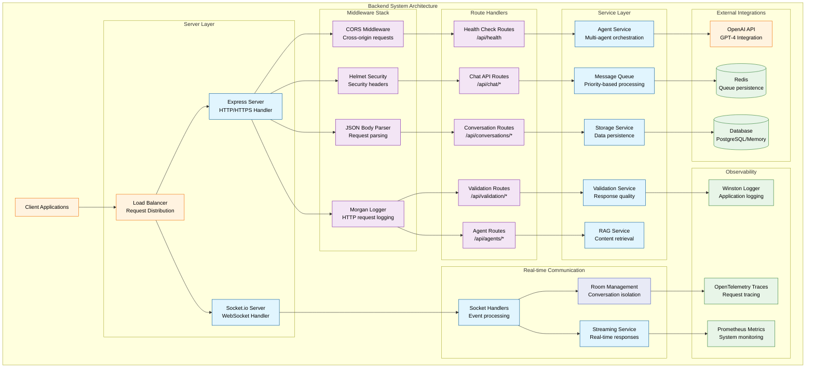
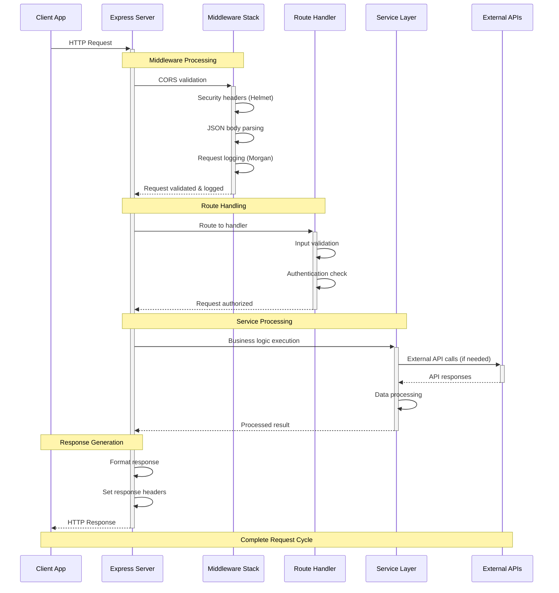
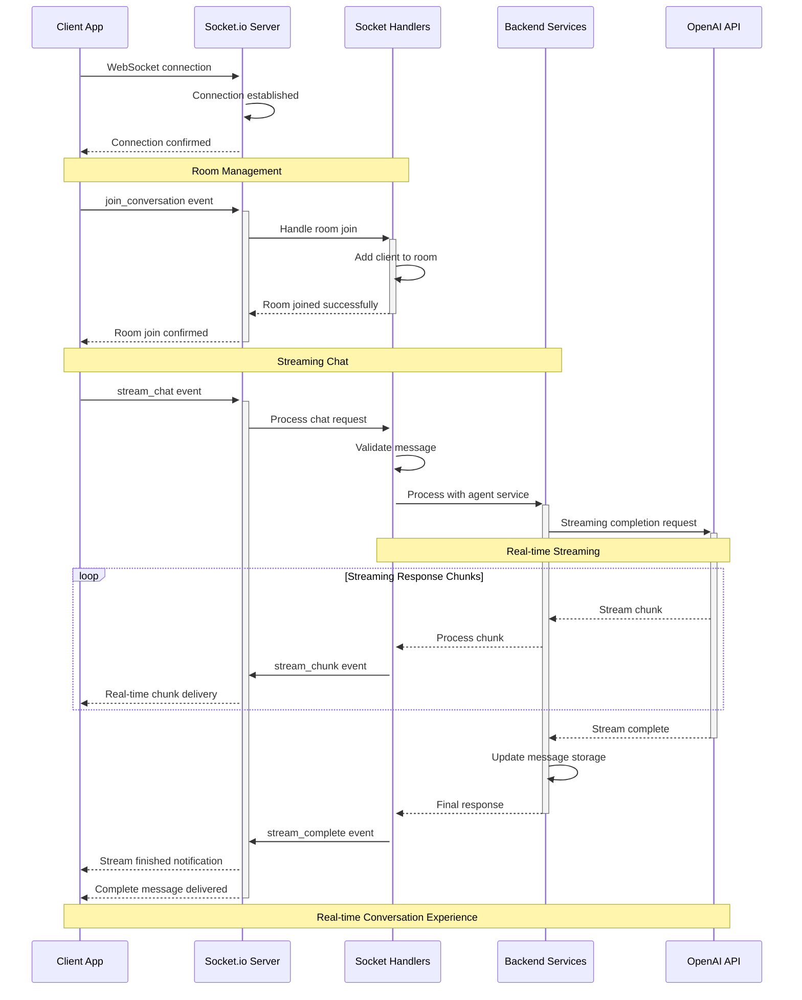

# Backend Guide

This document provides comprehensive information about the backend architecture, APIs, and development practices for the AI Chat Application.

## Table of Contents

- [Backend Guide](#backend-guide)
  - [Table of Contents](#table-of-contents)
  - [Overview](#overview)
  - [System Architecture](#system-architecture)
  - [Technology Stack](#technology-stack)
    - [Core Technologies](#core-technologies)
    - [Supporting Libraries](#supporting-libraries)
    - [Development Tools](#development-tools)
  - [Project Structure](#project-structure)
  - [Server Architecture](#server-architecture)
    - [Main Server Configuration](#main-server-configuration)
  - [Request Flow Patterns](#request-flow-patterns)
    - [REST API Request Flow](#rest-api-request-flow)
    - [WebSocket Real-time Flow](#websocket-real-time-flow)
  - [Service Integration Architecture](#service-integration-architecture)
  - [Error Handling \& Resilience {#error-handling--resilience}](#error-handling--resilience-error-handling--resilience)
  - [API Design](#api-design)
    - [RESTful Endpoints](#restful-endpoints)
      - [Health Check](#health-check)
      - [Chat Routes](#chat-routes)
      - [Conversation Routes](#conversation-routes)
  - [WebSocket Implementation](#websocket-implementation)
    - [Socket.io Event Handlers](#socketio-event-handlers)
  - [Data Storage](#data-storage)
    - [In-Memory Storage Implementation](#in-memory-storage-implementation)
  - [OpenAI Integration](#openai-integration)
    - [Streaming Response Implementation](#streaming-response-implementation)
  - [Error Handling](#error-handling)
    - [Centralized Error Handling](#centralized-error-handling)
  - [Performance Optimization](#performance-optimization)
    - [Connection Management](#connection-management)
    - [Caching Strategy](#caching-strategy)
  - [Security Implementation](#security-implementation)
    - [Authentication \& Authorization {#authentication--authorization}](#authentication--authorization-authentication--authorization)
  - [Benefits](#benefits)
    - [Scalability](#scalability)
    - [Reliability](#reliability)
    - [Security](#security)
    - [Developer Experience](#developer-experience)

## Overview

The backend is built with Node.js, Express, and TypeScript, providing a robust API server with real-time WebSocket capabilities. It integrates with OpenAI's API for AI responses and includes comprehensive error handling, logging, and streaming support.

## System Architecture



## Technology Stack

### Core Technologies

- **Node.js** - JavaScript runtime environment
- **Express 5** - Web application framework
- **TypeScript** - Type safety and better developer experience
- **Socket.io** - Real-time bidirectional event-based communication

### Supporting Libraries

- **OpenAI SDK** - OpenAI API integration
- **UUID** - Unique identifier generation
- **CORS** - Cross-origin resource sharing
- **Helmet** - Security middleware
- **Morgan** - HTTP request logger

### Development Tools

- **Nodemon** - Development server auto-reload
- **TSC** - TypeScript compiler
- **ESLint** - Code linting
- **Prettier** - Code formatting

## Project Structure

```
backend/
├── src/
│   ├── routes/            # API route handlers
│   │   ├── chat.ts        # Chat API endpoints
│   │   └── conversations.ts # Conversation management
│   ├── socket/            # WebSocket handlers
│   │   └── socketHandlers.ts # Socket.io event handlers
│   ├── storage/           # Data storage layer
│   │   └── memoryStorage.ts # In-memory storage implementation
│   ├── types.ts           # TypeScript type definitions
│   └── index.ts           # Main server file
├── package.json           # Dependencies and scripts
├── tsconfig.json          # TypeScript configuration
├── .env                   # Environment variables
├── .env.example           # Environment template
└── .gitignore             # Git ignore rules
```

## Server Architecture

### Main Server Configuration

```typescript
// src/index.ts
import express from 'express';
import { createServer } from 'http';
import { Server } from 'socket.io';
import cors from 'cors';
import { setupSocketHandlers } from './socket/socketHandlers';
import chatRoutes from './routes/chat';
import conversationRoutes from './routes/conversations';

const app = express();
const server = createServer(app);
const io = new Server(server, {
  cors: {
    origin: process.env.FRONTEND_URL || 'http://localhost:8081',
    methods: ['GET', 'POST'],
  },
});

// Middleware
app.use(
  cors({
    origin: process.env.FRONTEND_URL || 'http://localhost:8081',
  }),
);
app.use(express.json());

// Routes
app.use('/api/chat', chatRoutes);
app.use('/api/conversations', conversationRoutes);

// Health check
app.get('/api/health', (req, res) => {
  res.json({
    status: 'OK',
    timestamp: new Date().toISOString(),
    version: '1.0.0',
  });
});

// Socket.io setup
setupSocketHandlers(io);

const PORT = process.env.PORT || 5001;
server.listen(PORT, () => {
  console.log(`🚀 Server running on port ${PORT}`);
  console.log(`📡 WebSocket server ready`);
});
```

## Request Flow Patterns

### REST API Request Flow



### WebSocket Real-time Flow



## Service Integration Architecture

```mermaid
graph TB
    subgraph "Backend Service Integration"
        HTTPRequest[HTTP Request] --> ExpressRouter[Express Router]
        SocketEvent[Socket Event] --> SocketHandler[Socket Handler]
        
        subgraph "Request Processing Layer"
            ExpressRouter --> RequestValidator[Request Validator<br/>Input validation & sanitization]
            SocketHandler --> EventValidator[Event Validator<br/>WebSocket event validation]
            
            RequestValidator --> AuthMiddleware[Auth Middleware<br/>Authentication & authorization]
            EventValidator --> SocketAuth[Socket Authentication<br/>Connection validation]
        end
        
        subgraph "Business Logic Layer"
            AuthMiddleware --> AgentOrchestrator[Agent Orchestrator<br/>Multi-agent coordination]
            SocketAuth --> AgentOrchestrator
            
            AgentOrchestrator --> MessageProcessor[Message Processor<br/>Queue & priority handling]
            AgentOrchestrator --> ConversationMgr[Conversation Manager<br/>Context & continuity]
            AgentOrchestrator --> ValidationEngine[Validation Engine<br/>Response quality]
        end
        
        subgraph "Data Access Layer"
            MessageProcessor --> StorageInterface[Storage Interface<br/>Abstraction layer]
            ConversationMgr --> StorageInterface
            ValidationEngine --> StorageInterface
            
            StorageInterface --> MemoryStorage[Memory Storage<br/>In-memory implementation]
            StorageInterface --> DatabaseStorage[Database Storage<br/>Persistent implementation]
            StorageInterface --> CacheLayer[Cache Layer<br/>Redis/Memory cache]
        end
        
        subgraph "External Service Layer"
            AgentOrchestrator --> OpenAIService[OpenAI Service<br/>AI model integration]
            AgentOrchestrator --> RAGService[RAG Service<br/>Content retrieval]
            ValidationEngine --> PrometheusMetrics[Prometheus Metrics<br/>Performance tracking]
            
            OpenAIService --> OpenAIAPI[OpenAI API<br/>GPT-4 Completion]
            RAGService --> ContentDatabase[(Content Database<br/>Curated content)]
            PrometheusMetrics --> MetricsEndpoint[Metrics Endpoint<br/>/metrics]
        end
        
        subgraph "Response Layer"
            MemoryStorage --> ResponseFormatter[Response Formatter<br/>API response structuring]
            DatabaseStorage --> ResponseFormatter
            CacheLayer --> ResponseFormatter
            
            ResponseFormatter --> HTTPResponse[HTTP Response<br/>JSON API response]
            ResponseFormatter --> SocketResponse[Socket Response<br/>Real-time events]
        end
    end

    classDef service fill:#e1f5fe,stroke:#01579b,color:#000
    classDef data fill:#e8f5e8,stroke:#2e7d32,color:#000
    classDef external fill:#fff3e0,stroke:#ef6c00,color:#000
    classDef processing fill:#f3e5f5,stroke:#7b1fa2,color:#000
    classDef response fill:#e8eaf6,stroke:#3f51b5,color:#000
    
    class ExpressRouter,SocketHandler,AgentOrchestrator,MessageProcessor,ConversationMgr,ValidationEngine,StorageInterface,OpenAIService,RAGService,PrometheusMetrics,ResponseFormatter service
    class MemoryStorage,DatabaseStorage,CacheLayer,ContentDatabase,MetricsEndpoint data
    class HTTPRequest,SocketEvent,OpenAIAPI,HTTPResponse,SocketResponse external
    class RequestValidator,EventValidator,AuthMiddleware,SocketAuth processing
```



## Error Handling & Resilience {#error-handling--resilience}

```mermaid
graph TB
    subgraph "Error Handling Architecture"
        IncomingRequest[Incoming Request] --> ErrorBoundary[Error Boundary<br/>Global error catching]
        
        subgraph "Error Classification"
            ErrorBoundary --> ValidationError[Validation Errors<br/>400 Bad Request]
            ErrorBoundary --> AuthError[Authentication Errors<br/>401 Unauthorized]
            ErrorBoundary --> NotFoundError[Not Found Errors<br/>404 Not Found]
            ErrorBoundary --> ServerError[Server Errors<br/>500 Internal Server]
            ErrorBoundary --> ExternalError[External API Errors<br/>502/503/504 Gateway]
        end
        
        subgraph "Error Processing"
            ValidationError --> ErrorLogger[Error Logger<br/>Winston/Console logging]
            AuthError --> ErrorLogger
            NotFoundError --> ErrorLogger
            ServerError --> ErrorLogger
            ExternalError --> ErrorLogger
            
            ErrorLogger --> MetricsCollector[Metrics Collector<br/>Error rate tracking]
            MetricsCollector --> AlertSystem[Alert System<br/>Error threshold monitoring]
        end
        
        subgraph "Recovery Strategies"
            ExternalError --> RetryLogic[Retry Logic<br/>Exponential backoff]
            ServerError --> FallbackResponse[Fallback Response<br/>Default/cached responses]
            
            RetryLogic --> CircuitBreaker[Circuit Breaker<br/>Prevent cascading failures]
            FallbackResponse --> GracefulDegradation[Graceful Degradation<br/>Partial functionality]
        end
        
        subgraph "Response Generation"
            ValidationError --> ErrorFormatter[Error Response Formatter]
            AuthError --> ErrorFormatter
            NotFoundError --> ErrorFormatter
            CircuitBreaker --> ErrorFormatter
            GracefulDegradation --> ErrorFormatter
            
            ErrorFormatter --> StructuredResponse[Structured Error Response<br/>Consistent format]
            StructuredResponse --> ClientResponse[Client Response<br/>HTTP status + error details]
        end
        
        subgraph "Monitoring & Learning"
            AlertSystem --> IncidentResponse[Incident Response<br/>Automated escalation]
            ClientResponse --> ErrorAnalytics[Error Analytics<br/>Pattern detection]
            
            ErrorAnalytics --> SystemImprovement[System Improvement<br/>Proactive fixes]
            IncidentResponse --> PostMortem[Post-mortem Analysis<br/>Root cause investigation]
        end
    end

    classDef service fill:#e1f5fe,stroke:#01579b,color:#000
    classDef data fill:#e8f5e8,stroke:#2e7d32,color:#000
    classDef external fill:#fff3e0,stroke:#ef6c00,color:#000
    classDef error fill:#ffcdd2,stroke:#d32f2f,color:#000
    classDef recovery fill:#c8e6c9,stroke:#388e3c,color:#000
    
    class ErrorBoundary,ErrorLogger,MetricsCollector,AlertSystem,RetryLogic,FallbackResponse,CircuitBreaker,GracefulDegradation,ErrorFormatter service
    class StructuredResponse,ErrorAnalytics,SystemImprovement,PostMortem data
    class IncomingRequest,ClientResponse,IncidentResponse external
    class ValidationError,AuthError,NotFoundError,ServerError,ExternalError error
    class RetryLogic,FallbackResponse,CircuitBreaker,GracefulDegradation recovery
```



## API Design

### RESTful Endpoints

#### Health Check

```typescript
// GET /api/health
app.get('/api/health', (req, res) => {
  res.json({
    status: 'OK',
    timestamp: new Date().toISOString(),
    version: '1.0.0',
    uptime: process.uptime(),
    memory: process.memoryUsage(),
  });
});
```

#### Chat Routes

```typescript
// routes/chat.ts
import express from 'express';
import { v4 as uuidv4 } from 'uuid';
import { storage } from '../storage/memoryStorage';
import { Message, Conversation, ChatRequest, ChatResponse } from '../types';

const router = express.Router();

// POST /api/chat - Send message (non-streaming)
router.post('/', async (req, res) => {
  try {
    const { message, conversationId }: ChatRequest = req.body;

    // Validate input
    if (!message || message.trim() === '') {
      return res.status(400).json({
        message: 'Message is required',
        code: 'INVALID_REQUEST',
      });
    }

    // Create or get conversation
    let conversation: Conversation;
    if (conversationId) {
      conversation = await storage.getConversation(conversationId);
      if (!conversation) {
        return res.status(404).json({
          message: 'Conversation not found',
          code: 'CONVERSATION_NOT_FOUND',
        });
      }
    } else {
      // Create new conversation
      conversation = {
        id: uuidv4(),
        title: message.substring(0, 50) + (message.length > 50 ? '...' : ''),
        messages: [],
        createdAt: new Date(),
        updatedAt: new Date(),
      };
      await storage.createConversation(conversation);
    }

    // Add user message
    const userMessage: Message = {
      id: uuidv4(),
      content: message,
      role: 'user',
      timestamp: new Date(),
      conversationId: conversation.id,
    };

    await storage.addMessage(conversation.id, userMessage);

    // Generate AI response (placeholder)
    const aiResponse: Message = {
      id: uuidv4(),
      content: 'This is a placeholder response. OpenAI integration needed.',
      role: 'assistant',
      timestamp: new Date(),
      conversationId: conversation.id,
    };

    await storage.addMessage(conversation.id, aiResponse);

    // Get updated conversation
    const updatedConversation = await storage.getConversation(conversation.id);

    const response: ChatResponse = {
      message: aiResponse,
      conversation: updatedConversation!,
    };

    res.json(response);
  } catch (error) {
    console.error('Chat error:', error);
    res.status(500).json({
      message: 'Internal server error',
      code: 'INTERNAL_ERROR',
    });
  }
});

export default router;
```

#### Conversation Routes

```typescript
// routes/conversations.ts
import express from 'express';
import { storage } from '../storage/memoryStorage';

const router = express.Router();

// GET /api/conversations - Get all conversations
router.get('/', async (req, res) => {
  try {
    const conversations = await storage.getConversations();
    res.json(conversations);
  } catch (error) {
    console.error('Get conversations error:', error);
    res.status(500).json({
      message: 'Internal server error',
      code: 'INTERNAL_ERROR',
    });
  }
});

// GET /api/conversations/:id - Get specific conversation
router.get('/:id', async (req, res) => {
  try {
    const { id } = req.params;
    const conversation = await storage.getConversation(id);

    if (!conversation) {
      return res.status(404).json({
        message: 'Conversation not found',
        code: 'CONVERSATION_NOT_FOUND',
      });
    }

    res.json(conversation);
  } catch (error) {
    console.error('Get conversation error:', error);
    res.status(500).json({
      message: 'Internal server error',
      code: 'INTERNAL_ERROR',
    });
  }
});

// DELETE /api/conversations/:id - Delete conversation
router.delete('/:id', async (req, res) => {
  try {
    const { id } = req.params;
    const success = await storage.deleteConversation(id);

    if (!success) {
      return res.status(404).json({
        message: 'Conversation not found',
        code: 'CONVERSATION_NOT_FOUND',
      });
    }

    res.json({ message: 'Conversation deleted successfully' });
  } catch (error) {
    console.error('Delete conversation error:', error);
    res.status(500).json({
      message: 'Internal server error',
      code: 'INTERNAL_ERROR',
    });
  }
});

export default router;
```

## WebSocket Implementation

### Socket.io Event Handlers

```typescript
// socket/socketHandlers.ts
import { Server, Socket } from 'socket.io';
import { v4 as uuidv4 } from 'uuid';
import OpenAI from 'openai';
import { storage } from '../storage/memoryStorage';
import { Message, Conversation, StreamChatRequest, StreamChunk } from '../types';

let openai: OpenAI | null = null;

// Initialize OpenAI if API key is available
if (process.env.OPENAI_API_KEY) {
  openai = new OpenAI({
    apiKey: process.env.OPENAI_API_KEY,
  });
}

export const setupSocketHandlers = (io: Server) => {
  io.on('connection', (socket: Socket) => {
    console.log('Client connected:', socket.id);

    // Handle conversation joining
    socket.on('join_conversation', (data: { conversationId: string }) => {
      const { conversationId } = data;
      socket.join(conversationId);
      console.log(`Socket ${socket.id} joined conversation ${conversationId}`);
    });

    // Handle conversation leaving
    socket.on('leave_conversation', (data: { conversationId: string }) => {
      const { conversationId } = data;
      socket.leave(conversationId);
      console.log(`Socket ${socket.id} left conversation ${conversationId}`);
    });

    // Handle streaming chat
    socket.on('stream_chat', async (data: StreamChatRequest) => {
      try {
        const { message, conversationId } = data;

        console.log('🔄 Received stream_chat request:', { message, conversationId });

        // Validate input
        if (!message || message.trim() === '') {
          socket.emit('error', { message: 'Message is required' });
          return;
        }

        // Get or create conversation
        let conversation = await storage.getConversation(conversationId);
        if (!conversation) {
          conversation = {
            id: conversationId,
            title: message.substring(0, 50) + (message.length > 50 ? '...' : ''),
            messages: [],
            createdAt: new Date(),
            updatedAt: new Date(),
          };
          await storage.createConversation(conversation);
        }

        // Join conversation room
        socket.join(conversationId);

        // Add user message
        const userMessage: Message = {
          id: uuidv4(),
          content: message,
          role: 'user',
          timestamp: new Date(),
          conversationId,
        };

        await storage.addMessage(conversationId, userMessage);

        // Create AI response message
        const aiMessage: Message = {
          id: uuidv4(),
          content: '',
          role: 'assistant',
          timestamp: new Date(),
          conversationId,
        };

        await storage.addMessage(conversationId, aiMessage);

        // Emit stream start
        io.to(conversationId).emit('stream_start', {
          messageId: aiMessage.id,
          conversationId,
        });

        // Handle OpenAI streaming or fallback
        if (openai) {
          console.log('🤖 Starting OpenAI streaming request...');

          try {
            const stream = await openai.chat.completions.create({
              model: 'gpt-4',
              messages: [
                { role: 'system', content: 'You are a helpful assistant.' },
                { role: 'user', content: message },
              ],
              stream: true,
            });

            console.log('✅ OpenAI stream created successfully');

            let accumulatedContent = '';
            let chunkCount = 0;

            for await (const chunk of stream) {
              const deltaContent = chunk.choices[0]?.delta?.content || '';
              if (deltaContent) {
                accumulatedContent += deltaContent;
                chunkCount++;

                console.log(`📡 Sending chunk ${chunkCount}: "${deltaContent}..."`);

                // Emit chunk to all clients in conversation
                io.to(conversationId).emit('stream_chunk', {
                  messageId: aiMessage.id,
                  content: accumulatedContent,
                  isComplete: false,
                });
              }
            }

            // Update message in storage
            await storage.updateMessage(conversationId, aiMessage.id, {
              content: accumulatedContent,
            });

            // Emit final chunk
            io.to(conversationId).emit('stream_chunk', {
              messageId: aiMessage.id,
              content: accumulatedContent,
              isComplete: true,
            });

            console.log(
              `🏁 OpenAI streaming completed. Total chunks: ${chunkCount}, Full content length: ${accumulatedContent.length}`,
            );
          } catch (openaiError) {
            console.error('OpenAI streaming error:', openaiError);
            // Fallback to simple response
            const fallbackContent =
              'I apologize, but I encountered an error while processing your request. Please try again.';

            await storage.updateMessage(conversationId, aiMessage.id, {
              content: fallbackContent,
            });

            io.to(conversationId).emit('stream_chunk', {
              messageId: aiMessage.id,
              content: fallbackContent,
              isComplete: true,
            });
          }
        } else {
          // Demo mode without OpenAI
          const demoResponse =
            'This is a demo response. To enable AI responses, add your OpenAI API key to the environment variables.';

          await storage.updateMessage(conversationId, aiMessage.id, {
            content: demoResponse,
          });

          io.to(conversationId).emit('stream_chunk', {
            messageId: aiMessage.id,
            content: demoResponse,
            isComplete: true,
          });
        }

        // Emit stream complete
        io.to(conversationId).emit('stream_complete', {
          messageId: aiMessage.id,
          conversationId,
        });
      } catch (error) {
        console.error('Stream chat error:', error);
        socket.emit('error', { message: 'Internal server error' });
      }
    });

    // Handle disconnect
    socket.on('disconnect', () => {
      console.log('Client disconnected:', socket.id);
    });
  });
};
```

## Data Storage

### In-Memory Storage Implementation

```typescript
// storage/memoryStorage.ts
import { Conversation, Message } from '../types';

export interface StorageService {
  getConversations(): Promise<Conversation[]>;
  getConversation(id: string): Promise<Conversation | null>;
  createConversation(conversation: Conversation): Promise<Conversation>;
  updateConversation(id: string, updates: Partial<Conversation>): Promise<Conversation | null>;
  deleteConversation(id: string): Promise<boolean>;
  addMessage(conversationId: string, message: Message): Promise<Message>;
  updateMessage(conversationId: string, messageId: string, updates: Partial<Message>): Promise<Message | null>;
}

class MemoryStorage implements StorageService {
  private conversations: Map<string, Conversation> = new Map();

  async getConversations(): Promise<Conversation[]> {
    return Array.from(this.conversations.values()).sort((a, b) => b.updatedAt.getTime() - a.updatedAt.getTime());
  }

  async getConversation(id: string): Promise<Conversation | null> {
    return this.conversations.get(id) || null;
  }

  async createConversation(conversation: Conversation): Promise<Conversation> {
    this.conversations.set(conversation.id, conversation);
    return conversation;
  }

  async updateConversation(id: string, updates: Partial<Conversation>): Promise<Conversation | null> {
    const conversation = this.conversations.get(id);
    if (!conversation) return null;

    const updated = { ...conversation, ...updates, updatedAt: new Date() };
    this.conversations.set(id, updated);
    return updated;
  }

  async deleteConversation(id: string): Promise<boolean> {
    return this.conversations.delete(id);
  }

  async addMessage(conversationId: string, message: Message): Promise<Message> {
    const conversation = this.conversations.get(conversationId);
    if (!conversation) {
      throw new Error('Conversation not found');
    }

    conversation.messages.push(message);
    conversation.updatedAt = new Date();

    return message;
  }

  async updateMessage(conversationId: string, messageId: string, updates: Partial<Message>): Promise<Message | null> {
    const conversation = this.conversations.get(conversationId);
    if (!conversation) return null;

    const messageIndex = conversation.messages.findIndex(m => m.id === messageId);
    if (messageIndex === -1) return null;

    const updated = { ...conversation.messages[messageIndex], ...updates };
    conversation.messages[messageIndex] = updated;
    conversation.updatedAt = new Date();

    return updated;
  }
}

export const storage = new MemoryStorage();
```

## OpenAI Integration

### Streaming Response Implementation

```typescript
// Example OpenAI streaming integration
import OpenAI from 'openai';

const openai = new OpenAI({
  apiKey: process.env.OPENAI_API_KEY,
});

export const streamChatCompletion = async (
  messages: OpenAI.Chat.Completions.ChatCompletionMessage[],
  onChunk: (content: string) => void,
  onComplete: (fullContent: string) => void,
) => {
  try {
    const stream = await openai.chat.completions.create({
      model: 'gpt-4',
      messages,
      stream: true,
      temperature: 0.7,
      max_tokens: 2000,
    });

    let accumulatedContent = '';

    for await (const chunk of stream) {
      const deltaContent = chunk.choices[0]?.delta?.content || '';
      if (deltaContent) {
        accumulatedContent += deltaContent;
        onChunk(accumulatedContent);
      }
    }

    onComplete(accumulatedContent);
  } catch (error) {
    console.error('OpenAI streaming error:', error);
    throw error;
  }
};
```

## Error Handling

### Centralized Error Handling

```typescript
// middleware/errorHandler.ts
import { Request, Response, NextFunction } from 'express';

export interface AppError extends Error {
  statusCode: number;
  code: string;
  isOperational: boolean;
}

export const createError = (message: string, statusCode: number, code: string): AppError => {
  const error = new Error(message) as AppError;
  error.statusCode = statusCode;
  error.code = code;
  error.isOperational = true;
  return error;
};

export const errorHandler = (error: AppError, req: Request, res: Response, next: NextFunction) => {
  // Log error details
  console.error('Error occurred:', {
    message: error.message,
    stack: error.stack,
    statusCode: error.statusCode,
    code: error.code,
    url: req.url,
    method: req.method,
    timestamp: new Date().toISOString(),
  });

  // Don't expose internal errors in production
  if (process.env.NODE_ENV === 'production' && !error.isOperational) {
    return res.status(500).json({
      message: 'Internal server error',
      code: 'INTERNAL_ERROR',
    });
  }

  // Send error response
  res.status(error.statusCode || 500).json({
    message: error.message || 'Internal server error',
    code: error.code || 'INTERNAL_ERROR',
    ...(process.env.NODE_ENV === 'development' && { stack: error.stack }),
  });
};

// Error handling middleware for async routes
export const asyncHandler = (fn: Function) => {
  return (req: Request, res: Response, next: NextFunction) => {
    Promise.resolve(fn(req, res, next)).catch(next);
  };
};

// Common error responses
export const errorResponses = {
  validation: (message: string) => createError(message, 400, 'VALIDATION_ERROR'),
  unauthorized: () => createError('Unauthorized access', 401, 'UNAUTHORIZED'),
  forbidden: () => createError('Access forbidden', 403, 'FORBIDDEN'),
  notFound: (resource: string) => createError(`${resource} not found`, 404, 'NOT_FOUND'),
  conflict: (message: string) => createError(message, 409, 'CONFLICT'),
  tooManyRequests: () => createError('Too many requests', 429, 'RATE_LIMIT_EXCEEDED'),
  internal: (message?: string) => createError(message || 'Internal server error', 500, 'INTERNAL_ERROR'),
  badGateway: () => createError('Bad gateway', 502, 'BAD_GATEWAY'),
  serviceUnavailable: () => createError('Service unavailable', 503, 'SERVICE_UNAVAILABLE'),
};

// Usage in routes
export const exampleRouteWithErrorHandling = asyncHandler(async (req: Request, res: Response) => {
  const { id } = req.params;
  
  if (!id) {
    throw errorResponses.validation('ID is required');
  }
  
  const data = await someAsyncOperation(id);
  
  if (!data) {
    throw errorResponses.notFound('Resource');
  }
  
  res.json(data);
});
```

## Performance Optimization

### Connection Management

```typescript
// Enhanced server configuration with performance optimizations
import cluster from 'cluster';
import os from 'os';

if (cluster.isPrimary) {
  // Fork workers equal to CPU cores
  const numCPUs = os.cpus().length;
  console.log(`Master ${process.pid} is running`);
  
  for (let i = 0; i < numCPUs; i++) {
    cluster.fork();
  }
  
  cluster.on('exit', (worker, code, signal) => {
    console.log(`Worker ${worker.process.pid} died`);
    cluster.fork(); // Replace dead worker
  });
} else {
  // Worker process
  const app = createExpressApp();
  
  // Performance optimizations
  app.use(compression()); // Gzip compression
  app.use(helmet()); // Security headers
  app.use(rateLimit({
    windowMs: 15 * 60 * 1000, // 15 minutes
    max: 100 // Limit each IP to 100 requests per windowMs
  }));
  
  console.log(`Worker ${process.pid} started`);
}
```

### Caching Strategy

```typescript
// Redis-based caching implementation
import Redis from 'ioredis';

const redis = new Redis({
  host: process.env.REDIS_HOST || 'localhost',
  port: parseInt(process.env.REDIS_PORT || '6379'),
  retryDelayOnFailover: 100,
  maxRetriesPerRequest: 3,
});

export class CacheService {
  private defaultTTL = 3600; // 1 hour
  
  async get<T>(key: string): Promise<T | null> {
    try {
      const cached = await redis.get(key);
      return cached ? JSON.parse(cached) : null;
    } catch (error) {
      console.error('Cache get error:', error);
      return null;
    }
  }
  
  async set<T>(key: string, value: T, ttl?: number): Promise<void> {
    try {
      await redis.setex(
        key, 
        ttl || this.defaultTTL, 
        JSON.stringify(value)
      );
    } catch (error) {
      console.error('Cache set error:', error);
    }
  }
  
  async del(key: string): Promise<void> {
    try {
      await redis.del(key);
    } catch (error) {
      console.error('Cache delete error:', error);
    }
  }
  
  async flush(): Promise<void> {
    try {
      await redis.flushall();
    } catch (error) {
      console.error('Cache flush error:', error);
    }
  }
}

export const cache = new CacheService();
```

## Security Implementation

### Authentication & Authorization {#authentication--authorization}

```typescript
// JWT-based authentication middleware
import jwt from 'jsonwebtoken';
import bcrypt from 'bcrypt';

interface User {
  id: string;
  email: string;
  role: 'user' | 'admin';
}

interface JWTPayload {
  userId: string;
  email: string;
  role: string;
}

export class AuthService {
  private jwtSecret = process.env.JWT_SECRET || 'fallback-secret';
  private saltRounds = 12;
  
  async hashPassword(password: string): Promise<string> {
    return bcrypt.hash(password, this.saltRounds);
  }
  
  async verifyPassword(password: string, hash: string): Promise<boolean> {
    return bcrypt.compare(password, hash);
  }
  
  generateToken(user: User): string {
    const payload: JWTPayload = {
      userId: user.id,
      email: user.email,
      role: user.role,
    };
    
    return jwt.sign(payload, this.jwtSecret, {
      expiresIn: '24h',
      issuer: 'ai-chat-app',
    });
  }
  
  verifyToken(token: string): JWTPayload {
    try {
      return jwt.verify(token, this.jwtSecret) as JWTPayload;
    } catch (error) {
      throw errorResponses.unauthorized();
    }
  }
}

// Authentication middleware
export const authenticate = (req: Request, res: Response, next: NextFunction) => {
  const authHeader = req.headers.authorization;
  
  if (!authHeader || !authHeader.startsWith('Bearer ')) {
    throw errorResponses.unauthorized();
  }
  
  const token = authHeader.substring(7);
  
  try {
    const payload = authService.verifyToken(token);
    req.user = payload;
    next();
  } catch (error) {
    throw errorResponses.unauthorized();
  }
};

// Authorization middleware
export const authorize = (roles: string[]) => {
  return (req: Request, res: Response, next: NextFunction) => {
    if (!req.user || !roles.includes(req.user.role)) {
      throw errorResponses.forbidden();
    }
    next();
  };
};

export const authService = new AuthService();
```

## Benefits

### Scalability

- **Modular Architecture**: Independent service scaling and deployment
- **Connection Pooling**: Efficient database and external API connections
- **Caching Strategy**: Redis-based performance optimization
- **Load Balancing**: Multi-process clustering for high availability

### Reliability

- **Comprehensive Error Handling**: Graceful failure management and recovery
- **Circuit Breaker Pattern**: Protection against cascading failures  
- **Health Monitoring**: Real-time system health tracking
- **Graceful Degradation**: Partial functionality during service disruptions

### Security

- **Input Validation**: Comprehensive request sanitization and validation
- **Authentication**: JWT-based secure user authentication
- **Authorization**: Role-based access control
- **Security Headers**: Helmet middleware for HTTP security

### Developer Experience

- **Type Safety**: Full TypeScript implementation with strict typing
- **Error Transparency**: Detailed error logging and debugging information  
- **API Documentation**: Comprehensive endpoint documentation and examples
- **Testing Support**: Built-in testing frameworks and utilities

The backend system provides a robust, scalable foundation for the AI chat application with enterprise-grade security, performance optimization, and comprehensive error handling that ensures reliable operation under various load conditions.
```
