# Frontend Guide - Mobile Application

This document provides comprehensive information about the mobile application architecture, components, and development practices for the AI Chat Application built with React Native and Expo.

## Table of Contents

1. [Overview](#overview)
2. [Technology Stack](#technology-stack)
3. [Project Structure](#project-structure)
4. [Component Architecture](#component-architecture)
5. [Navigation](#navigation)
6. [State Management](#state-management)
7. [Styling and Theming](#styling-and-theming)
8. [Real-time Communication](#real-time-communication-architecture)
9. [API Integration](#api-integration)
10. [TypeScript Usage](#typescript-usage)
11. [Development Workflow](#development-workflow)
12. [Performance Optimization](#performance-optimization)
13. [Testing](#testing)

## Overview

The mobile application is built with React Native and Expo, providing a native mobile experience for iOS and Android platforms. It features real-time messaging, AI response validation dashboard, and intelligent agent interactions with cross-platform compatibility.

## Mobile Architecture


## Technology Stack

### Core Technologies

- **React Native** - Native mobile development framework
- **Expo** - Development platform and toolchain
- **TypeScript** - Type safety and better developer experience
- **Expo Router** - File-based routing system
- **React Native Paper** - Material Design components
- **Socket.io Client** - Real-time WebSocket communication

### Supporting Libraries

- **React Native Markdown Display** - Markdown rendering
- **React Native Gesture Handler** - Native gesture support
- **React Native Reanimated** - Advanced animations
- **React Native Safe Area Context** - Safe area handling
- **Expo Vector Icons** - Icon library

## Project Structure

```text
frontend/
├── app/                    # Expo Router app directory
│   ├── (tabs)/            # Tab navigation group
│   │   ├── _layout.tsx    # Tab layout
│   │   └── index.tsx      # Home tab (main entry point with chat and input)
│   ├── _layout.tsx        # Root layout
│   └── +not-found.tsx     # 404 page
├── components/            # React Native components
│   ├── AgentStatusBar.tsx # Agent status display
│   ├── AuthProvider.tsx   # Authentication provider
│   ├── ChatScreen.tsx     # Main chat interface
│   ├── MessageInput.tsx   # Message input component
│   └── ui/               # UI components
│       ├── IconSymbol.tsx
│       └── TabBarBackground.tsx
├── services/              # API and external services
│   └── socketService.ts   # WebSocket client
├── types/                 # TypeScript type definitions
│   └── index.ts          # Shared types
├── constants/             # App constants
│   └── Colors.ts         # Color scheme (includes DiscordColors)
├── hooks/                 # Custom hooks
│   ├── useColorScheme.ts # Theme detection
│   └── useThemeColor.ts  # Color theming
├── assets/               # Static assets
│   ├── images/          # Image files
│   └── fonts/           # Custom fonts
├── package.json          # Dependencies and scripts
├── tsconfig.json         # TypeScript configuration
├── app.json             # Expo app configuration
└── App.tsx              # Application root
```

## Component Architecture

## React Native Component Flow


### Component Hierarchy Tree

```mermaid
graph LR
    subgraph "Component Tree Structure"
        App[📱 App] --> Root[🏠 RootLayout]
        Root --> Tabs[📑 TabLayout]
        
        Tabs --> Home[🏠 HomeTab]
        
        Home --> HomeScreen[🖥️ HomeScreen]
        
        HomeScreen --> ChatScreen[💬 ChatScreen]
        HomeScreen --> Input[⌨️ MessageInput]
        
        ChatScreen --> Messages[📜 MessageList]
        Messages --> Bubble[💭 MessageBubble]
        Input --> Send[📤 SendButton]
        
        subgraph "Shared Components"
            Bubble --> Text[📝 ThemedText]
            HomeScreen --> View[🎨 ThemedView]
        end
    end

    classDef root fill:#e1f5fe,stroke:#01579b,color:#000
    classDef screen fill:#e8f5e8,stroke:#2e7d32,color:#000
    classDef component fill:#f3e5f5,stroke:#7b1fa2,color:#000
    classDef shared fill:#e8eaf6,stroke:#3f51b5,color:#000
    
    class App,Root,Tabs root
    class Home,HomeScreen,ChatScreen screen
    class Messages,Input,Bubble,Send component
    class Text,View shared
```



### Core Components

#### 1. HomeScreen (index.tsx)

The main entry point and coordinator for the chat experience. Located at `app/(tabs)/index.tsx`. This component manages:
- Socket connection lifecycle
- Conversation state management
- Message event handlers (new messages, streaming, proactive messages)
- UI coordination between ChatScreen and MessageInput

```typescript
import React, { useState, useEffect } from 'react';
import { View, AppState, ActivityIndicator, Text } from 'react-native';
import { DiscordColors } from '../../constants/Colors';
import { socketService } from '../../services/socketService';
import ChatScreen from '../../components/ChatScreen';
import MessageInput from '../../components/MessageInput';
import type { Conversation, Message } from '../../types';

export default function HomeScreen() {
  const [conversation, setConversation] = useState<Conversation | null>(null);
  const [isLoading, setIsLoading] = useState(true);
  const [isConnected, setIsConnected] = useState(false);

  // Initialize socket connection on app start
  useEffect(() => {
    const initializeApp = async () => {
      await socketService.connect();
      setIsConnected(true);
      setIsLoading(false);
      
      // Auto-send initial support request for demo
      setTimeout(() => {
        socketService.sendStreamingMessage({
          message: "Hello, I need technical support...",
          conversationId: undefined,
        });
      }, 1000);
    };
    initializeApp();

    return () => socketService.disconnect();
  }, []);

  // Handles socket events: new messages, streaming, proactive messages
  useEffect(() => {
    socketService.onNewMessage(handleNewMessage);
    socketService.onStreamStart(handleStreamStart);
    socketService.onStreamChunk(handleStreamChunk);
    socketService.onStreamComplete(handleStreamComplete);
    socketService.onProactiveMessage(handleProactiveMessage);

    return () => {
      socketService.removeListener('new_message');
      // ... cleanup other listeners
    };
  }, []);

  return (
    <View style={styles.container}>
      <ChatScreen conversation={conversation} />
      <MessageInput
        conversationId={conversation?.id}
        onMessageSent={handleMessageSent}
        disabled={!isConnected}
      />
    </View>
  );
}
```

#### 2. ChatScreen.tsx

Main chat interface component that displays the conversation messages.

```typescript
import React from 'react';
import { View, FlatList, StyleSheet } from 'react-native';
import { DiscordColors } from '../constants/Colors';
import type { Conversation, Message } from '../types';

interface ChatScreenProps {
  conversation: Conversation | null;
}

export default function ChatScreen({ conversation }: ChatScreenProps) {
  return (
    <View style={styles.container}>
      <FlatList
        data={conversation?.messages || []}
        keyExtractor={(item) => item.id}
        renderItem={({ item }) => (
          <MessageBubble message={item} />
        )}
        // Supports streaming message status: pending, streaming, complete
      />
    </View>
  );
}
```

#### 3. MessageInput.tsx

Native mobile message input with enhanced UX.

```typescript
import React, { useState } from 'react';
import { View, TextInput, TouchableOpacity } from 'react-native';
import { IconButton, useTheme } from 'react-native-paper';
import { Haptics } from 'expo-haptics';

interface MessageInputProps {
  onSendMessage: (message: string) => void;
  disabled?: boolean;
}

export default function MessageInput({ onSendMessage, disabled }: MessageInputProps) {
  const [message, setMessage] = useState('');
  const theme = useTheme();

  const handleSend = () => {
    if (message.trim()) {
      Haptics.impactAsync(Haptics.ImpactFeedbackStyle.Light);
      onSendMessage(message.trim());
      setMessage('');
    }
  };

  return (
    <View style={{
      flexDirection: 'row',
      padding: 16,
      backgroundColor: theme.colors.surface,
      alignItems: 'flex-end',
    }}>
      <TextInput
        style={{
          flex: 1,
          borderWidth: 1,
          borderColor: theme.colors.outline,
          borderRadius: 20,
          paddingHorizontal: 16,
          paddingVertical: 12,
          maxHeight: 100,
          backgroundColor: theme.colors.background,
        }}
        value={message}
        onChangeText={setMessage}
        placeholder="Type a message..."
        multiline
        editable={!disabled}
        onSubmitEditing={handleSend}
        blurOnSubmit={false}
      />
      <IconButton
        icon="send"
        onPress={handleSend}
        disabled={disabled || !message.trim()}
        style={{ marginLeft: 8 }}
      />
    </View>
  );
}
```

## Navigation

### Expo Router File-based Routing

The app uses Expo Router with file-based routing:

```typescript
// app/_layout.tsx - Root layout
import { Stack } from 'expo-router';

export default function RootLayout() {
  return (
    <Stack>
      <Stack.Screen name="(tabs)" options={{ headerShown: false }} />
      <Stack.Screen name="+not-found" />
    </Stack>
  );
}
```

```typescript
// app/(tabs)/_layout.tsx - Tab navigation
import { Tabs } from 'expo-router';
import { IconSymbol } from '@/components/ui/IconSymbol';
import { Colors } from '@/constants/Colors';

export default function TabLayout() {
  const colorScheme = useColorScheme();

  return (
    <Tabs
      screenOptions={{
        tabBarActiveTintColor: Colors[colorScheme ?? 'light'].tint,
        headerShown: false,
      }}>
      <Tabs.Screen
        name="index"
        options={{
          title: 'Home',
          tabBarIcon: ({ color }) => (
            <IconSymbol size={28} name="house.fill" color={color} />
          ),
        }}
      />
    </Tabs>
  );
}
```

## State Management

### React Native State with Hooks

```typescript
// Custom hooks for state management
export function useSocket() {
  const [isConnected, setIsConnected] = useState(false);
  const [messages, setMessages] = useState<Message[]>([]);
  const [activeAgent, setActiveAgent] = useState<AgentType>('general');

  useEffect(() => {
    socketService.connect();

    const handleConnect = () => setIsConnected(true);
    const handleDisconnect = () => setIsConnected(false);
    const handleMessage = (message: Message) => {
      setMessages(prev => [...prev, message]);
    };
    const handleAgentSelection = (agent: AgentType) => {
      setActiveAgent(agent);
    };

    socketService.on('connect', handleConnect);
    socketService.on('disconnect', handleDisconnect);
    socketService.on('message', handleMessage);
    socketService.on('agent_selection', handleAgentSelection);

    return () => {
      socketService.off('connect', handleConnect);
      socketService.off('disconnect', handleDisconnect);
      socketService.off('message', handleMessage);
      socketService.off('agent_selection', handleAgentSelection);
    };
  }, []);

  return {
    isConnected,
    messages,
    activeAgent,
    sendMessage: socketService.sendMessage,
  };
}
```

## Styling and Theming

### Discord-Inspired Color Scheme

The app uses a Discord-inspired dark theme for the chat interface:

```typescript
// constants/Colors.ts
export const DiscordColors = {
  // Background colors
  backgroundPrimary: '#36393f',
  backgroundSecondary: '#2f3136',
  backgroundTertiary: '#202225',
  
  // Text colors
  textNormal: '#dcddde',
  textMuted: '#72767d',
  textLink: '#00aff4',
  
  // Status colors
  green: '#3ba55c',
  red: '#ed4245',
  
  // Interactive elements
  interactive: '#8e9297',
};

export const Colors = {
  light: {
    text: '#11181C',
    background: '#fff',
    tint: '#0a7ea4',
    icon: '#687076',
    tabIconDefault: '#687076',
    tabIconSelected: '#0a7ea4',
  },
  dark: {
    text: '#ECEDEE',
    background: '#151718',
    tint: '#fff',
    icon: '#9BA1A6',
    tabIconDefault: '#9BA1A6',
    tabIconSelected: '#fff',
  },
};
```

### Custom Hook for Theme

```typescript
// hooks/useThemeColor.ts
import { useColorScheme } from './useColorScheme';
import { Colors } from '@/constants/Colors';

export function useThemeColor(
  props: { light?: string; dark?: string },
  colorName: keyof typeof Colors.light & keyof typeof Colors.dark,
) {
  const theme = useColorScheme() ?? 'light';
  const colorFromProps = props[theme];

  if (colorFromProps) {
    return colorFromProps;
  } else {
    return Colors[theme][colorName];
  }
}
```

## Real-time Communication Architecture


## State Management Flow


### Socket.io Service for Mobile

```typescript
// services/socketService.ts
import io, { Socket } from 'socket.io-client';
import { Message, AgentType, ValidationResult } from '../types';

class SocketService {
  private socket: Socket | null = null;
  private isConnected = false;

  connect() {
    this.socket = io(process.env.EXPO_PUBLIC_API_URL || 'http://localhost:5001', {
      transports: ['websocket'],
      timeout: 20000,
    });

    this.socket.on('connect', () => {
      this.isConnected = true;
      console.log('Connected to server');
    });

    this.socket.on('disconnect', () => {
      this.isConnected = false;
      console.log('Disconnected from server');
    });

    this.socket.on('connect_error', error => {
      console.error('Connection error:', error);
    });
  }

  disconnect() {
    if (this.socket) {
      this.socket.disconnect();
      this.socket = null;
      this.isConnected = false;
    }
  }

  sendMessage(message: string, conversationId?: string) {
    if (this.socket && this.isConnected) {
      this.socket.emit('stream_chat', { message, conversationId });
    }
  }

  on(event: string, callback: Function) {
    this.socket?.on(event, callback);
  }

  off(event: string, callback?: Function) {
    this.socket?.off(event, callback);
  }

  // Mobile-specific methods
  onStreamChunk(callback: (chunk: { messageId: string; content: string }) => void) {
    this.socket?.on('stream_chunk', callback);
  }

  onValidationResult(callback: (result: ValidationResult) => void) {
    this.socket?.on('validation_result', callback);
  }

  onAgentSelection(callback: (agent: AgentType) => void) {
    this.socket?.on('agent_selection', callback);
  }
}

export const socketService = new SocketService();
```

## API Integration

### Mobile-optimized HTTP Client

```typescript
// services/api.ts (mobile-specific)
import Constants from 'expo-constants';

const API_URL = process.env.EXPO_PUBLIC_API_URL || 'http://localhost:5001';

class ApiService {
  private async request<T>(endpoint: string, options: RequestInit = {}): Promise<T> {
    const url = `${API_URL}${endpoint}`;

    const response = await fetch(url, {
      ...options,
      headers: {
        'Content-Type': 'application/json',
        ...options.headers,
      },
    });

    if (!response.ok) {
      throw new Error(`HTTP error! status: ${response.status}`);
    }

    return response.json();
  }

  async getValidationMetrics() {
    return this.request<ValidationMetrics>('/api/validation/metrics');
  }

  async getConversationHistory() {
    return this.request<Message[]>('/api/conversations');
  }

  async submitFeedback(messageId: string, rating: number, comment?: string) {
    return this.request('/api/feedback', {
      method: 'POST',
      body: JSON.stringify({ messageId, rating, comment }),
    });
  }
}

export const apiService = new ApiService();
```

## TypeScript Usage

### Mobile-specific Type Definitions

```typescript
// types/index.ts
export interface Message {
  id: string;
  content: string;
  role: 'user' | 'assistant';
  timestamp: Date;
  conversationId: string;
  agentType?: AgentType;
  validationScore?: number;
}

export interface ValidationMetrics {
  averageQuality: number;
  totalMessages: number;
  agentStats: AgentStats[];
  responseTimeAvg: number;
  satisfactionScore: number;
}

export interface AgentStats {
  type: AgentType;
  responseCount: number;
  averageQuality: number;
  averageResponseTime: number;
}

export type AgentType = 'general' | 'technical' | 'joke' | 'trivia' | 'gif' | 'hold_agent';

// Navigation types for Expo Router
export type RootTabParamList = {
  index: undefined;
  explore: undefined;
};

// Component prop types
export interface ChatScreenProps {
  conversationId?: string;
}

export interface ValidationDashboardProps {
  refreshInterval?: number;
}
```

## Development Workflow

### Available Scripts

```json
{
  "scripts": {
    "start": "expo start",
    "android": "expo start --android",
    "ios": "expo start --ios",
    "web": "expo start --web",
    "lint": "expo lint",
    "reset-project": "node ./scripts/reset-project.js"
  }
}
```

### Environment Configuration

```bash
# .env (development)
EXPO_PUBLIC_API_URL=http://localhost:5001

# .env.production
EXPO_PUBLIC_API_URL=https://your-production-api.com
```

### Development Tools

1. **Expo CLI** - Development server and tools
2. **Expo Go** - Mobile app for testing
3. **React Native Debugger** - Debugging tool
4. **Flipper** - Advanced debugging
5. **EAS Build** - Cloud build service

## Mobile UI/UX Patterns


## Performance Optimization


### Mobile-specific Optimizations

```typescript
// Lazy loading for heavy components
const ValidationDashboard = React.lazy(() => import('../components/ValidationDashboard'));

// Memoization for expensive operations
const MessageList = React.memo(({ messages }) => {
  return (
    <FlatList
      data={messages}
      renderItem={({ item }) => <MessageBubble message={item} />}
      keyExtractor={(item) => item.id}
      getItemLayout={(data, index) => ({
        length: ITEM_HEIGHT,
        offset: ITEM_HEIGHT * index,
        index,
      })}
      removeClippedSubviews={true}
      maxToRenderPerBatch={10}
      windowSize={10}
    />
  );
});

// Image optimization
import { Image } from 'expo-image';

const OptimizedImage = ({ source, ...props }) => (
  <Image
    source={source}
    contentFit="cover"
    transition={200}
    {...props}
  />
);
```

## Testing

### Mobile Testing Strategy

```typescript
// __tests__/ChatScreen.test.tsx
import React from 'react';
import { render, fireEvent, waitFor } from '@testing-library/react-native';
import ChatScreen from '../components/ChatScreen';
import { socketService } from '../services/socketService';

// Mock socket service
jest.mock('../services/socketService');

describe('ChatScreen', () => {
  it('renders correctly', () => {
    const { getByPlaceholderText } = render(<ChatScreen />);
    expect(getByPlaceholderText('Type a message...')).toBeTruthy();
  });

  it('sends message when button is pressed', async () => {
    const { getByPlaceholderText, getByRole } = render(<ChatScreen />);
    const input = getByPlaceholderText('Type a message...');
    const sendButton = getByRole('button');

    fireEvent.changeText(input, 'Hello');
    fireEvent.press(sendButton);

    await waitFor(() => {
      expect(socketService.sendMessage).toHaveBeenCalledWith('Hello', undefined);
    });
  });
});
```

### Testing Tools

```json
{
  "devDependencies": {
    "@testing-library/react-native": "^12.0.0",
    "@testing-library/jest-native": "^5.0.0",
    "jest": "^29.0.0",
    "jest-expo": "^51.0.0"
  }
}
```

This mobile frontend guide provides comprehensive documentation for the React Native/Expo application, covering all aspects of mobile development, from component architecture to testing strategies.
