# RAG (Retrieval-Augmented Generation) System Documentation

## Overview

The RAG system provides curated, high-quality content for entertainment agents, ensuring consistent and reliable responses even in demo mode without OpenAI API keys. This system combines intelligent content retrieval with quality-rated entertainment content.

## Architecture

```mermaid
graph TB
    subgraph "RAG System Architecture"
        UserQuery[User Query] --> AgentService[Agent Service]
        
        subgraph "Content Retrieval Layer"
            AgentService --> RAGService[RAG Service]
            RAGService --> ContentDB[(Content Database<br/>30 curated items)]
            RAGService --> SearchEngine[Search Engine]
            
            SearchEngine --> TagMatcher[Tag Matcher<br/>0.3pts per match]
            SearchEngine --> PhraseMatcher[Phrase Matcher<br/>0.8pts exact match]
            SearchEngine --> CategoryMatcher[Category Matcher<br/>0.2pts per match]
            SearchEngine --> QualityBooster[Quality Booster<br/>+0.1pts for rating]
        end
        
        subgraph "Content Types"
            ContentDB --> JokeContent[Jokes Database<br/>🎭 10 premium jokes]
            ContentDB --> TriviaContent[Trivia Database<br/>🧠 10 fascinating facts]
            ContentDB --> GIFContent[GIF Database<br/>🎬 10 curated GIFs]
        end
        
        subgraph "Search Processing"
            TagMatcher --> RelevanceScorer[Relevance Scorer]
            PhraseMatcher --> RelevanceScorer
            CategoryMatcher --> RelevanceScorer
            QualityBooster --> RelevanceScorer
            
            RelevanceScorer --> ResultFilter[Result Filter<br/>Min 0.1 threshold]
            ResultFilter --> ResultRanker[Result Ranker<br/>Score-based sorting]
        end
        
        subgraph "Content Delivery"
            ResultRanker --> ContentResponse[Content Response]
            ContentResponse --> FallbackHandler[Fallback Handler<br/>Random if no matches]
            FallbackHandler --> QualityValidation[Quality Validation<br/>4-5 star ratings only]
        end
        
        subgraph "Agent Integration"
            QualityValidation --> JokeAgent[Joke Agent<br/>😄 Humor delivery]
            QualityValidation --> TriviaAgent[Trivia Agent<br/>🧠 Fact sharing]
            QualityValidation --> GIFAgent[GIF Agent<br/>🎬 Visual entertainment]
        end
    end

    classDef service fill:#e1f5fe,stroke:#01579b,color:#000
    classDef data fill:#e8f5e8,stroke:#2e7d32,color:#000
    classDef external fill:#fff3e0,stroke:#ef6c00,color:#000
    classDef content fill:#f3e5f5,stroke:#7b1fa2,color:#000
    classDef agent fill:#e8eaf6,stroke:#3f51b5,color:#000
    
    class RAGService,SearchEngine,TagMatcher,PhraseMatcher,CategoryMatcher,QualityBooster,RelevanceScorer,ResultFilter,ResultRanker,FallbackHandler,QualityValidation service
    class ContentDB,JokeContent,TriviaContent,GIFContent data
    class UserQuery,ContentResponse external
    class JokeAgent,TriviaAgent,GIFAgent agent
```



### Core Components

1. **RAGService** - Main service class managing content database and search
2. **ContentItem** - Individual content pieces (jokes, trivia, GIFs)
3. **SearchQuery** - Query interface for content retrieval
4. **SearchResult** - Scored search results with relevance metrics

## Content Database

### Current Content Statistics

- **10 Premium Jokes** (Dad jokes, tech humor, story jokes)
- **10 Fascinating Trivia Facts** (Science, animals, space, history)
- **10 Curated GIFs** (Reactions, emotions, celebrations)
- **Quality Ratings**: All content rated 4-5 stars
- **15+ Categories** for organized content discovery
- **100+ Search Tags** for intelligent content matching

### Content Structure

```typescript
interface ContentItem {
  id: string; // Unique identifier
  type: 'joke' | 'trivia' | 'gif'; // Content type
  content: string; // Main content (joke text, fact, GIF URL)
  category?: string; // Content category
  tags: string[]; // Searchable tags
  rating?: number; // Quality rating (1-5)
  metadata?: any; // Additional data (alt text, descriptions)
}
```

### Content Categories

#### Jokes

- `dad_joke` - Classic dad humor and puns
- `tech_joke` - Programming and technology humor
- `story_joke` - Narrative-style jokes

#### Trivia

- `animals` - Animal facts and biology
- `space` - Astronomy and space exploration
- `science` - Scientific discoveries and phenomena
- `history` - Historical facts and events
- `food` - Food science and culinary facts
- `human_body` - Human biology and health
- `mathematics` - Mathematical concepts and paradoxes

#### GIFs

- `funny` - General humor and comedy
- `cute` - Adorable and heartwarming content
- `excited` - Celebration and joy reactions
- `surprised` - Shock and amazement reactions
- `applause` - Approval and congratulations
- `party` - Celebration and festive content
- `thumbs_up` - Positive approval
- `facepalm` - Disappointment reactions
- `shrug` - Confusion and uncertainty
- `mind_blown` - Astonishment reactions

## API Reference

### RAGService Methods

#### `search(query: SearchQuery): SearchResult[]`

Searches for content based on query parameters.

**Parameters:**

```typescript
interface SearchQuery {
  text: string; // Search text
  type?: 'joke' | 'trivia' | 'gif'; // Content type filter
  category?: string; // Category filter
  tags?: string[]; // Tag filters
  limit?: number; // Result limit (default: 10)
}
```

**Returns:** Array of SearchResult objects with relevance scores.

#### `searchForAgent(agentType: AgentType, query: string, fallbackToRandom?: boolean): ContentItem | null`

Simplified search for specific agent types.

**Parameters:**

- `agentType` - Agent requesting content ('joke', 'trivia', 'gif')
- `query` - User's message for context
- `fallbackToRandom` - Whether to return random content if no matches (default: true)

#### `getRandomContent(type: 'joke' | 'trivia' | 'gif', category?: string): ContentItem | null`

Retrieves random content of specified type.

#### `addContent(item: ContentItem): void`

Dynamically adds new content to the database.

#### `getStats(): { [type: string]: number }`

Returns content statistics by type.

#### `getTopRated(type?: string, limit?: number): ContentItem[]`

Gets highest-rated content, optionally filtered by type.

## Content Retrieval Flow


## Search Algorithm Architecture


### Search Algorithm Scoring

The RAG system uses intelligent relevance scoring:

1. **Exact Phrase Match** (0.8 points) - Direct content matches
2. **Tag Matching** (0.3 points per tag) - Contextual tag alignment
3. **Category Matching** (0.2 points) - Category relevance
4. **Content Keywords** (0.1 points per word) - General content relevance
5. **Quality Boost** (up to 0.1 points) - Based on content rating

**Minimum Threshold:** 0.1 relevance score required for results.

## Agent Integration Patterns

```mermaid
graph TB
    subgraph "Multi-Agent RAG Integration"
        AgentRequest[Agent Content Request] --> AgentRouter[Agent Router]
        
        subgraph "Agent-Specific Processing"
            AgentRouter --> JokePath[Joke Agent Path<br/>😄 Humor context]
            AgentRouter --> TriviaPath[Trivia Agent Path<br/>🧠 Educational context]
            AgentRouter --> GIFPath[GIF Agent Path<br/>🎬 Visual context]
        end
        
        subgraph "Content Customization"
            JokePath --> JokeRAG[Joke RAG Service<br/>Dad jokes, tech humor, stories]
            TriviaPath --> TriviaRAG[Trivia RAG Service<br/>Science, animals, space, history]
            GIFPath --> GIFRAG[GIF RAG Service<br/>Reactions, emotions, celebrations]
        end
        
        subgraph "Fallback Strategies"
            JokeRAG --> JokeFallback[Joke Fallback<br/>Random high-quality joke]
            TriviaRAG --> TriviaFallback[Trivia Fallback<br/>Random fascinating fact]
            GIFRAG --> GIFFallback[GIF Fallback<br/>Random appropriate GIF]
        end
        
        subgraph "Response Enhancement"
            JokeFallback --> JokeEnhancer[Joke Response Enhancer<br/>Add reaction prompts & emojis]
            TriviaFallback --> TriviaEnhancer[Trivia Response Enhancer<br/>Add follow-up questions]
            GIFFallback --> GIFEnhancer[GIF Response Enhancer<br/>Add context & alt text]
        end
        
        subgraph "Quality Assurance"
            JokeEnhancer --> QualityGate[Quality Gate<br/>4-5 star content only]
            TriviaEnhancer --> QualityGate
            GIFEnhancer --> QualityGate
            
            QualityGate --> FinalResponse[Enhanced Agent Response<br/>✅ Curated & contextual]
        end
        
        subgraph "Demo Mode Integration"
            FinalResponse --> DemoCheck{Demo Mode?}
            DemoCheck -->|Yes| DemoResponse[Demo Mode Response<br/>RAG content + demo notice]
            DemoCheck -->|No| ProductionResponse[Production Response<br/>RAG fallback if API fails]
        end
    end

    classDef service fill:#e1f5fe,stroke:#01579b,color:#000
    classDef data fill:#e8f5e8,stroke:#2e7d32,color:#000
    classDef external fill:#fff3e0,stroke:#ef6c00,color:#000
    classDef agent fill:#f3e5f5,stroke:#7b1fa2,color:#000
    classDef enhancement fill:#e8eaf6,stroke:#3f51b5,color:#000
    
    class AgentRouter,JokeRAG,TriviaRAG,GIFRAG,QualityGate,DemoCheck service
    class JokeFallback,TriviaFallback,GIFFallback data
    class AgentRequest,FinalResponse,DemoResponse,ProductionResponse external
    class JokePath,TriviaPath,GIFPath agent
    class JokeEnhancer,TriviaEnhancer,GIFEnhancer enhancement
```



## Content Management Workflow


## Integration with Agents

### Entertainment Agent Integration

Each entertainment agent uses RAG for consistent content delivery:

```typescript
// Example: Joke Master using RAG
const ragContent = ragService.searchForAgent('joke', userMessage, true);
if (ragContent) {
  return `${ragContent.content} 😄
  
🎭 *Learning from your reaction...* 
📚 *From curated joke collection*`;
}
```

### Demo Mode Enhancement

RAG provides reliable content when OpenAI API is unavailable:

- **Consistent Quality** - Pre-curated, rated content
- **No API Dependencies** - Works offline
- **Contextual Relevance** - Smart search matches user intent
- **Professional Experience** - Enterprise-grade content delivery

## Content Management

### Adding New Content

```typescript
// Add a new joke
ragService.addContent({
  id: 'joke_011',
  type: 'joke',
  content: "Why don't programmers like nature? It has too many bugs!",
  category: 'tech_joke',
  tags: ['programming', 'tech', 'bugs', 'nature', 'pun'],
  rating: 4,
});

// Add a new trivia fact
ragService.addContent({
  id: 'trivia_011',
  type: 'trivia',
  content:
    'Did you know that butterflies taste with their feet? They have chemoreceptors on their feet that help them identify suitable host plants!',
  category: 'animals',
  tags: ['butterflies', 'insects', 'taste', 'biology', 'nature'],
  rating: 5,
});

// Add a new GIF
ragService.addContent({
  id: 'gif_011',
  type: 'gif',
  content: 'https://media.giphy.com/media/example123/giphy.gif',
  category: 'celebration',
  tags: ['celebrate', 'happy', 'success', 'achievement', 'joy'],
  rating: 4,
  metadata: {
    description: 'Victory celebration dance',
    alt: 'Person celebrating with victory dance',
  },
});
```

### Content Guidelines

#### Quality Standards

- **Rating 4-5**: Only high-quality, tested content
- **Family Friendly**: All content appropriate for general audiences
- **Engaging**: Content should entertain and delight users
- **Accurate**: Trivia facts must be factually correct
- **Accessible**: GIFs should include alt text and descriptions

#### Tag Strategy

- **Descriptive Tags**: Clear, searchable keywords
- **Multiple Contexts**: Include various relevant tags
- **Consistent Naming**: Use standardized tag formats
- **Semantic Grouping**: Related concepts should share tags

## Performance Monitoring

### Available Metrics

```typescript
// Get content statistics
const stats = ragService.getStats();
// Returns: { joke: 10, trivia: 10, gif: 10 }

// Get top-rated content
const topJokes = ragService.getTopRated('joke', 5);

// Search performance logging
// Automatically logs search queries and result counts
```

### Usage Analytics

The system automatically logs:

- Search queries and result counts
- Content relevance scores
- Agent usage patterns
- Content performance metrics

## Best Practices

### For Developers

1. **Always Provide Fallback**: Use `fallbackToRandom: true` for agent searches
2. **Cache Frequently Used Content**: Store popular items for quick access
3. **Monitor Search Performance**: Review logs for optimization opportunities
4. **Test Content Quality**: Validate new content before adding
5. **Update Regularly**: Keep content fresh and relevant

### For Content Creators

1. **Write Clear Content**: Ensure jokes/facts are easy to understand
2. **Use Descriptive Tags**: Include all relevant keywords
3. **Rate Honestly**: Use 1-5 scale based on entertainment value
4. **Test with Users**: Validate content with target audience
5. **Include Metadata**: Provide context and accessibility information

## Troubleshooting

### Common Issues

**No Search Results:**

- Check minimum relevance threshold (0.1)
- Verify tag spelling and categories
- Use broader search terms

**Poor Content Relevance:**

- Review and improve tag assignments
- Add more contextual tags
- Consider content categorization

**Performance Issues:**

- Monitor database size (current: 30 items)
- Consider search result limits
- Review complex query patterns

### Debug Mode

Enable detailed logging:

```typescript
// Search logs include query details and result counts
// Check console for: "🔍 RAG Search: 'query' found X results"
```

## Future Enhancements

### Planned Features

1. **Vector Embeddings** - Semantic search capabilities
2. **Machine Learning** - Personalized content recommendations
3. **Content Analytics** - Detailed usage and performance metrics
4. **Dynamic Learning** - Content rating based on user reactions
5. **External Integration** - API connections to content services
6. **Advanced Filtering** - Complex query capabilities
7. **Content Validation** - Automated quality checking
8. **A/B Testing** - Content performance comparison

### Scalability Considerations

- **Database Growth**: Current in-memory storage suitable up to ~1000 items
- **Search Performance**: O(n) search acceptable for current scale
- **Content Expansion**: Easy addition of new content types
- **Multi-language Support**: Framework ready for localization

## Contributing

### Adding Content Types

1. Update `ContentItem` type definition
2. Add new categories and tags
3. Update search algorithms if needed
4. Add validation rules
5. Update documentation

### Content Submission Process

1. Create content following quality guidelines
2. Add appropriate tags and ratings
3. Test with multiple search queries
4. Submit for review and validation
5. Add to production database

This RAG system provides a robust foundation for reliable, high-quality entertainment content that enhances the customer service experience while maintaining professional standards.
