# AI Response Validation System

## Overview

The AI Response Validation System provides comprehensive quality assurance for all AI-generated responses in the chat application. It validates responses for content quality, technical accuracy, appropriateness, and coherence while maintaining detailed logs for monitoring and improvement.

## Architecture


### Core Components

1. **ResponseValidator** (`backend/src/validation/responseValidator.ts`)
   - Main validation engine
   - Calculates quality metrics and scores
   - Identifies and categorizes issues
   - Maintains validation logs

2. **Validation API** (`backend/src/routes/validation.ts`)
   - RESTful endpoints for accessing validation data
   - Statistics, logs, and filtering capabilities
   - Real-time monitoring support

3. **Integration Points**
   - Agent Service: Validates all AI responses
   - Socket Handlers: Validates proactive messages
   - Goal-Seeking System: Validates entertainment content

## Validation Metrics

```mermaid
graph TB
    subgraph "Validation Metrics Architecture"
        Input[AI Response] --> MetricEngine[Metric Calculation Engine]
        
        subgraph "Individual Metrics (0-1 scale)"
            MetricEngine --> R[Readability Score<br/>• Sentence complexity<br/>• Word difficulty<br/>• Flesch Reading Ease]
            MetricEngine --> T[Technical Accuracy<br/>• Term appropriateness<br/>• Agent specialization<br/>• Context relevance]
            MetricEngine --> A[Appropriateness Score<br/>• Professional tone<br/>• Language appropriateness<br/>• Customer service standards]
            MetricEngine --> C[Coherence Score<br/>• Logical flow<br/>• Sentence completeness<br/>• Contradiction detection]
        end
        
        subgraph "Weighted Scoring"
            R --> |20% weight| WeightedScore[Final Quality Score]
            T --> |20% weight| WeightedScore
            A --> |30% weight| WeightedScore
            C --> |30% weight| WeightedScore
        end
        
        subgraph "Pass/Fail Logic"
            WeightedScore --> Threshold{Score ≥ 0.7?}
            Threshold -->|≥ 0.7| PassResult[✅ PASS<br/>High Quality Response]
            Threshold -->|< 0.7| FailResult[❌ FAIL<br/>Quality Issues Detected]
        end
        
        subgraph "Issue Severity Classification"
            FailResult --> HighSev[🔴 High Severity<br/>• Empty responses<br/>• Inappropriate content<br/>• Critical technical errors]
            FailResult --> MedSev[🟡 Medium Severity<br/>• Poor readability<br/>• Minor technical issues<br/>• Tone problems]
            FailResult --> LowSev[🟢 Low Severity<br/>• Length optimization<br/>• Minor coherence issues<br/>• Style improvements]
        end
        
        subgraph "Prometheus Metrics"
            PassResult --> PassCounter[validation_pass_total<br/>Counter by agent_type]
            FailResult --> FailCounter[validation_fail_total<br/>Counter by agent_type, issue_type]
            WeightedScore --> ScoreHist[validation_score_histogram<br/>Histogram by agent_type]
            HighSev --> SevCounter[validation_issues_total<br/>Counter by severity, issue_type]
            MedSev --> SevCounter
            LowSev --> SevCounter
        end
    end

    classDef service fill:#e1f5fe,stroke:#01579b,color:#000
    classDef data fill:#e8f5e8,stroke:#2e7d32,color:#000
    classDef external fill:#fff3e0,stroke:#ef6c00,color:#000
    classDef success fill:#c8e6c9,stroke:#388e3c,color:#000
    classDef warning fill:#fff9c4,stroke:#f57f17,color:#000
    classDef error fill:#ffcdd2,stroke:#d32f2f,color:#000
    
    class MetricEngine,R,T,A,C,WeightedScore service
    class PassCounter,FailCounter,ScoreHist,SevCounter data
    class Input external
    class PassResult success
    class MedSev,LowSev warning
    class FailResult,HighSev error
```



### Quality Scoring (0-1 scale)

1. **Readability Score** (20% weight)
   - Sentence structure analysis
   - Word complexity assessment
   - Flesch Reading Ease calculation

2. **Technical Accuracy** (20% weight)
   - Appropriate use of technical terms
   - Agent specialization compliance
   - Context-appropriate responses

3. **Appropriateness Score** (30% weight)
   - Professional tone assessment
   - Inappropriate language detection
   - Customer service standards

4. **Coherence Score** (30% weight)
   - Logical flow analysis
   - Sentence completeness
   - Contradiction detection

### Issue Detection

Issues are categorized by type and severity:

#### Issue Types

- **Content**: Empty responses, repetitive content
- **Technical**: Incorrect technical advice, agent mismatch
- **Appropriateness**: Unprofessional language, tone issues
- **Length**: Too short/long for agent type
- **Coherence**: Incomplete sentences, logical errors

#### Severity Levels

- **High**: Critical issues requiring immediate attention
- **Medium**: Important issues affecting quality
- **Low**: Minor issues for optimization

## Validation Process


### Response Validation Flow

1. **Input Processing**
   - Agent type identification
   - User message analysis
   - Response content extraction

2. **Metric Calculation**
   - Individual metric scoring
   - Weighted overall score
   - Issue identification

3. **Quality Assessment**
   - Pass/fail determination (≥0.7 score)
   - High-severity issue detection
   - Recommendation generation

4. **Logging & Storage**
   - Validation result storage
   - Console logging for monitoring
   - Statistics aggregation

### Integration Points

#### Agent Service Integration

```typescript
// Validates all AI responses
const validationResult = responseValidator.validateResponse(
  agentType,
  userMessage,
  aiResponse,
  conversationId,
  userId,
  false, // Regular response
);
```

#### Proactive Message Validation

```typescript
// Validates proactive entertainment messages
const validationResult = responseValidator.validateResponse(
  proactiveResponse.agentUsed,
  action.message,
  proactiveResponse.content,
  conversationId,
  userId,
  true, // Proactive message
);
```

## API Endpoints

### Validation Statistics

```
GET /api/validation/stats
```

Returns overall validation statistics including:

- Total validations
- Average quality score
- Validation pass rate
- Issue breakdown by type/severity

### Validation Logs

```
GET /api/validation/logs?limit=50&offset=0
```

Returns paginated validation logs with:

- Validation results
- Agent performance data
- Issue details
- Timestamps

### Agent-Specific Logs

```
GET /api/validation/logs/:agentType
```

Returns validation logs filtered by agent type.

### Failed Validations

```
GET /api/validation/failed
```

Returns only failed validations for issue investigation.

### Validation Summary

```
GET /api/validation/summary
```

Returns validation summary grouped by agent type with:

- Performance metrics per agent
- Issue patterns
- Quality trends

### Clear Logs (Debug)

```
POST /api/validation/clear
```

Clears validation logs for testing purposes.

## Agent-Specific Validation

```mermaid
graph TB
    subgraph "Agent-Specific Validation Rules"
        Input[AI Response] --> AgentDetector[Agent Type Detection]
        
        subgraph "Length Validation by Agent"
            AgentDetector --> DadJoke[Dad Joke Agent<br/>20-200 chars<br/>🎭 Entertainment focused]
            AgentDetector --> Trivia[Trivia Agent<br/>50-300 chars<br/>🧠 Knowledge sharing]
            AgentDetector --> Technical[Technical Agent<br/>100-1000 chars<br/>⚙️ Problem solving]
            AgentDetector --> General[General Agent<br/>30-500 chars<br/>💬 Conversational]
            AgentDetector --> GIF[GIF Agent<br/>10-100 chars<br/>🎬 Visual responses]
        end
        
        subgraph "Specialization Validation"
            DadJoke --> EntertainCheck{Entertainment<br/>Content?}
            Trivia --> KnowledgeCheck{Educational<br/>Content?}
            Technical --> TechCheck{Technical<br/>Solution?}
            General --> ToneCheck{Appropriate<br/>Tone?}
            GIF --> VisualCheck{Visual<br/>Context?}
        end
        
        subgraph "Agent Performance Tracking"
            EntertainCheck --> DadMetrics[dad_joke_validation<br/>• Humor appropriateness<br/>• Length compliance<br/>• Family-friendly check]
            KnowledgeCheck --> TriviaMetrics[trivia_validation<br/>• Fact accuracy<br/>• Educational value<br/>• Engagement level]
            TechCheck --> TechMetrics[technical_validation<br/>• Solution accuracy<br/>• Completeness<br/>• Clarity]
            ToneCheck --> GeneralMetrics[general_validation<br/>• Conversational flow<br/>• Helpfulness<br/>• Engagement]
            VisualCheck --> GIFMetrics[gif_validation<br/>• Context relevance<br/>• Description quality<br/>• Appropriateness]
        end
        
        subgraph "Validation Results"
            DadMetrics --> AgentStats[Agent Performance Stats<br/>• Success rates by agent<br/>• Issue patterns<br/>• Quality trends]
            TriviaMetrics --> AgentStats
            TechMetrics --> AgentStats
            GeneralMetrics --> AgentStats
            GIFMetrics --> AgentStats
        end
    end

    classDef service fill:#e1f5fe,stroke:#01579b,color:#000
    classDef data fill:#e8f5e8,stroke:#2e7d32,color:#000
    classDef external fill:#fff3e0,stroke:#ef6c00,color:#000
    classDef agent fill:#f3e5f5,stroke:#7b1fa2,color:#000
    
    class AgentDetector,EntertainCheck,KnowledgeCheck,TechCheck,ToneCheck,VisualCheck service
    class DadMetrics,TriviaMetrics,TechMetrics,GeneralMetrics,GIFMetrics,AgentStats data
    class Input external
    class DadJoke,Trivia,Technical,General,GIF agent
```



### Expected Response Lengths

- **Dad Joke**: 20-200 characters
- **Trivia**: 50-300 characters
- **Technical**: 100-1000 characters
- **General**: 30-500 characters
- **GIF**: 10-100 characters

### Agent Specialization Checks

- Technical agents: Can provide technical solutions
- Non-technical agents: Should redirect technical queries
- Entertainment agents: Should maintain appropriate tone

## Monitoring & Alerting

### Console Logging

```
🔍 Validation Result [dad_joke] Score: 0.85, Valid: true
⚠️ Validation issues for technical response: [medium: Response too short]
❌ High severity validation issues detected for general response
```

### Real-time Monitoring

- Validation success rates
- Response quality trends
- Issue pattern detection
- Agent performance comparison

## Quality Assurance Features

### Automatic Issue Detection

- Inappropriate language scanning
- Technical accuracy verification
- Response length validation
- Coherence analysis

### Quality Scoring

- Weighted metric calculation
- Pass/fail thresholds
- Continuous improvement tracking

### Performance Analytics

- Agent-specific performance
- Issue trend analysis
- Quality improvement metrics

## Implementation Benefits

### Quality Assurance

- Consistent response quality
- Automated issue detection
- Performance monitoring
- Continuous improvement

### Debugging & Development

- Response quality insights
- Agent performance analysis
- Issue pattern identification
- System optimization data

### Customer Experience

- Higher quality responses
- Reduced inappropriate content
- Better agent specialization
- Improved user satisfaction

## Configuration

### Validation Thresholds

- **Pass Score**: ≥0.7 (70%)
- **High Severity**: Automatic failure
- **Log Retention**: 1000 most recent validations

### Agent Settings

- Customizable length expectations
- Agent-specific validation rules
- Technical accuracy requirements

## Future Enhancements

### Advanced Features

- Machine learning-based quality prediction
- User satisfaction correlation
- Response improvement suggestions
- Automated agent retraining triggers

### Integration Improvements

- Real-time dashboards
- Alert notifications
- Performance reporting
- Quality trend analysis

## Usage Examples

### Basic Validation Check

```typescript
const result = responseValidator.validateResponse(
  'technical',
  'How do I fix this JavaScript error?',
  'You can fix this by checking the console...',
  'conv_123',
  'user_456',
);

if (!result.isValid) {
  console.log('Issues:', result.issues);
}
```

### Getting Validation Statistics

```typescript
const stats = responseValidator.getValidationStats();
console.log(`Average score: ${stats.averageScore}`);
console.log(`Pass rate: ${stats.validationRate * 100}%`);
```

### Accessing Validation Logs

```typescript
const logs = responseValidator.getValidationLogs();
const recentFailures = logs.filter(log => !log.validationResult.isValid);
```

The validation system provides comprehensive quality assurance for the AI chat application, ensuring high-quality responses while providing detailed monitoring and improvement capabilities.
