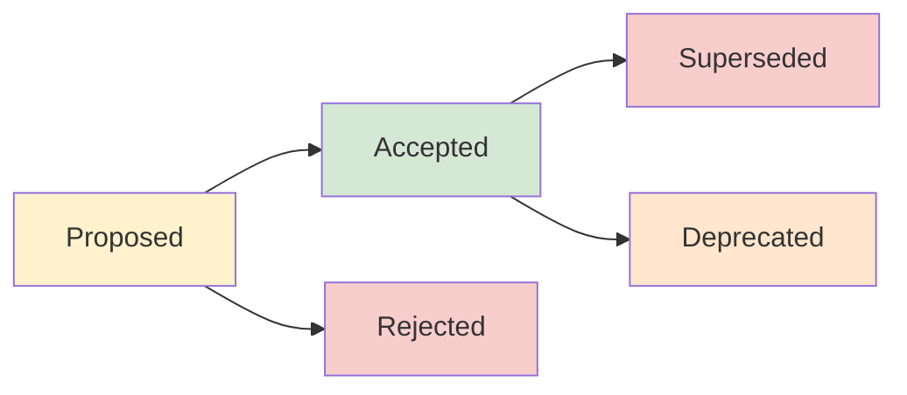

# Architecture Decision Records (ADRs)

This directory contains Architecture Decision Records (ADRs) for the AI Chat system. ADRs document significant architectural decisions that affect the system's structure, behavior, or non-functional characteristics.

## What is an ADR?

An Architecture Decision Record (ADR) is a document that captures an important architectural decision made along with its context and consequences. ADRs help:

- **Document the reasoning** behind architectural choices
- **Preserve institutional knowledge** when team members change
- **Facilitate onboarding** of new team members
- **Enable informed changes** by understanding past decisions
- **Avoid repeating past mistakes** or discussions

## ADR Process

### When to Write an ADR

Create an ADR when making decisions about:

- **Technology choices** (frameworks, libraries, databases)
- **Architectural patterns** (microservices vs monolith, event-driven architecture)
- **System boundaries** and service interfaces
- **Data storage strategies** and schemas
- **Security and compliance approaches**
- **Performance and scalability strategies**
- **Development practices** that affect architecture

### ADR Lifecycle



**Status Definitions:**

- **Proposed**: The ADR is under consideration
- **Accepted**: The ADR is approved and the decision is implemented
- **Superseded**: A new ADR has replaced this decision
- **Deprecated**: The decision is no longer recommended but may still be in use
- **Rejected**: The proposal was considered but not adopted

### ADR Template

Use the [ADR template](../../_templates/adr-template.md) when creating new ADRs:

```markdown
# ADR-NNNN: [Short Title]

**Date:** YYYY-MM-DD  
**Status:** [Proposed | Accepted | Superseded | Deprecated | Rejected]  
**Supersedes:** [List of ADR numbers this supersedes, if any]  
**Superseded by:** [ADR number that supersedes this, if any]

## Context and Problem Statement

[Describe the context and problem statement that led to this decision]

## Decision Drivers

- [Driver 1]
- [Driver 2]
- [Driver N]

## Considered Options

- [Option 1]
- [Option 2]
- [Option N]

## Decision Outcome

**Chosen option:** [Option X]

**Reasoning:** [Explanation of why this option was chosen]

### Consequences

**Positive:**
- [Consequence 1]
- [Consequence 2]

**Negative:**
- [Consequence 1]
- [Consequence 2]

**Neutral:**
- [Consequence 1]
- [Consequence 2]

## Implementation Notes

[Any specific implementation guidance, constraints, or considerations]

## Related Decisions

- [Link to related ADRs]
- [References to external documentation]
```

## Current ADRs

*Note: ADR files are created as architectural decisions are made. The following represent planned ADRs that will document key system decisions:*

### Infrastructure and Deployment

- **ADR-0001: Multi-Agent Architecture** - Decision to implement specialized agents for different conversation types
- **ADR-0002: Message Queue System** - Selection of Redis-based message queue for asynchronous processing  
- **ADR-0003: Observability Stack** - OpenTelemetry + Jaeger + Prometheus + Grafana for monitoring

### Data and Storage

- **ADR-0004: Database Strategy** - PostgreSQL for primary data storage with Redis for caching
- **ADR-0005: Validation Pipeline** - Real-time response validation and quality scoring

### Development and Operations

- **ADR-0006: Development Framework** - Node.js + TypeScript + React Native technology stack
- **ADR-0007: Container Strategy** - Docker + Docker Compose for development and deployment
- **ADR-0008: Testing Strategy** - Multi-layered testing approach with unit, integration, and E2E tests

## Creating a New ADR

### Step 1: Determine ADR Number

Find the next available ADR number by checking existing files:

```bash
ls docs/architecture/decisions/ | grep -E '^[0-9]{4}' | sort -n | tail -1
```

### Step 2: Copy Template

```bash
# Copy the template
cp docs/_templates/adr-template.md docs/architecture/decisions/NNNN-short-title.md

# Edit the new file
$EDITOR docs/architecture/decisions/NNNN-short-title.md
```

### Step 3: Fill Out Content

1. **Replace placeholder text** with actual content
2. **Set the status** to "Proposed" initially
3. **Describe the context** and problem thoroughly
4. **List all considered options** with pros/cons
5. **Document the decision** and reasoning
6. **Identify consequences** (positive, negative, neutral)

### Step 4: Review Process

1. **Create a pull request** with the new ADR
2. **Tag relevant stakeholders** for review
3. **Discuss in team meetings** if needed
4. **Iterate based on feedback**
5. **Change status to "Accepted"** when approved
6. **Merge the pull request**

### Step 5: Update Index

Add the new ADR to this README.md file in the appropriate section.

## ADR Best Practices

### Writing Guidelines

- **Be concise but complete** - Include all necessary context without unnecessary detail
- **Use clear language** - Avoid jargon and explain technical terms
- **Include diagrams** when they help explain the decision
- **Link to relevant resources** and documentation
- **Update status** as decisions evolve
- **Cross-reference** related ADRs

### Content Guidelines

- **Focus on "why"** not just "what" - Explain the reasoning behind decisions
- **Document alternatives** that were considered and why they were rejected
- **Be honest about trade-offs** - Every decision has consequences
- **Include implementation notes** for complex decisions
- **Specify success criteria** when applicable

### Maintenance Guidelines

- **Review ADRs regularly** - Ensure they're still relevant and accurate
- **Update status** when decisions change
- **Create superseding ADRs** instead of editing old ones
- **Archive obsolete ADRs** rather than deleting them
- **Keep the index updated** with new ADRs

## Tools and Automation

### ADR Management Scripts

```bash
# Create a new ADR (future enhancement)
./scripts/new-adr.sh "Multi-tenant Architecture"

# List all ADRs with status
./scripts/list-adrs.sh

# Update ADR status
./scripts/update-adr-status.sh 0001 "Superseded"

# Generate ADR index
./scripts/generate-adr-index.sh
```

### Integration with Development Workflow

- **Link ADRs in code comments** when implementing decisions
- **Reference ADRs in pull requests** that relate to architectural changes
- **Include ADR reviews** in architecture review meetings
- **Update project documentation** to reference relevant ADRs

## Examples and Templates

### Decision Context Examples

**Technology Selection:**
```
We need to choose a message queue solution that can handle high throughput 
with reliable delivery guarantees for our AI chat system.
```

**Architectural Pattern:**
```
The system is growing and we need to decide between maintaining a monolith 
or splitting into microservices to improve scalability and team autonomy.
```

**Data Strategy:**
```
User conversations are growing rapidly and we need to decide on a storage 
strategy that balances query performance with cost efficiency.
```

### Decision Outcome Examples

**Clear Decision:**
```
We will use Redis as our message queue because it provides the best balance 
of performance, reliability, and operational simplicity for our current scale.
```

**Decision with Timeline:**
```
We will migrate to microservices over 6 months, starting with the authentication 
service to minimize risk while gaining operational experience.
```

**Conditional Decision:**
```
We will use PostgreSQL for transactional data and implement read replicas 
if read performance becomes a bottleneck (measured by >200ms p95 latency).
```

## Related Documentation

- **[ADR Template](../../_templates/adr-template.md)** - Standard template for creating new ADRs
- **[Architecture Overview](../system-overview.md)** - High-level system architecture
- **[Component Documentation](../components/agents.md)** - Detailed component architecture
- **[Development Guidelines](../../reference/code-quality.md)** - Development standards and practices

## Resources

### ADR Tools and References

- **[ADR GitHub Organization](https://adr.github.io/)** - Collection of ADR resources and tools
- **[Documenting Architecture Decisions](http://thinkrelevance.com/blog/2011/11/15/documenting-architecture-decisions)** - Original blog post by Michael Nygard
- **[ADR Tools](https://github.com/npryce/adr-tools)** - Command-line tools for managing ADRs

### Best Practices Resources

- **[Architecture Decision Records in Action](https://www.thoughtworks.com/insights/blog/architecture/architecture-decision-records-in-action)** - ThoughtWorks article on ADR best practices
- **[When Should I Write an ADR?](https://engineering.atspotify.com/2020/04/when-should-i-write-an-architecture-decision-record/)** - Spotify Engineering blog post
- **[Lightweight Architecture Decision Records](https://www.thoughtworks.com/radar/techniques/lightweight-architecture-decision-records)** - ThoughtWorks Technology Radar entry
