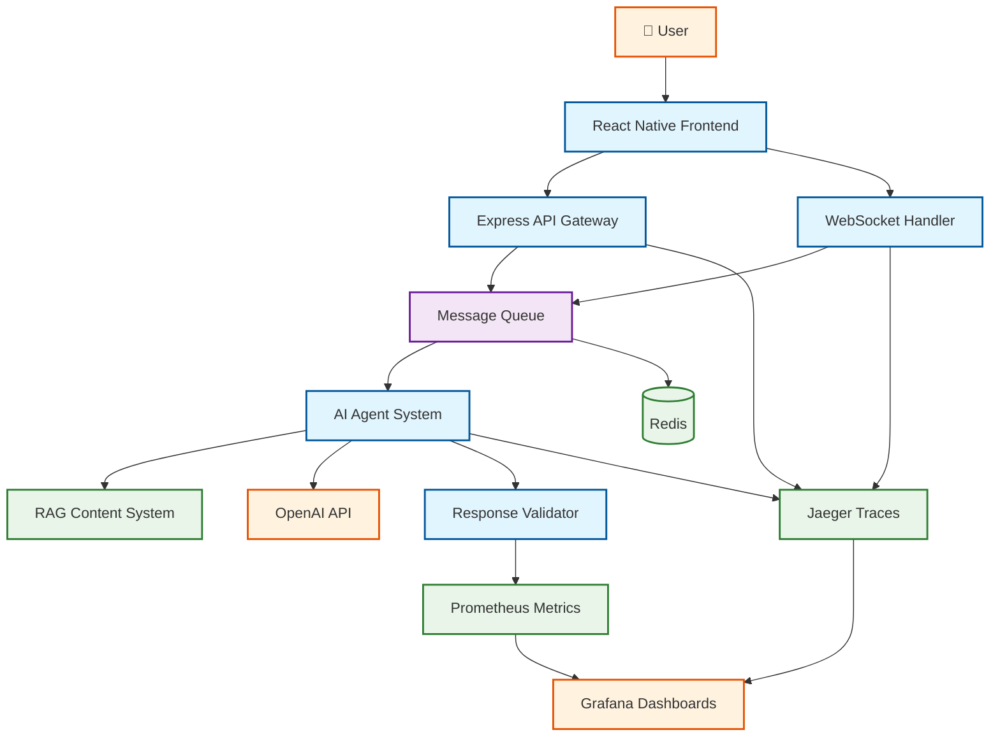

# Architecture Overview

This section provides comprehensive documentation of the AI Goal-Seeking System's architecture, from high-level system design to detailed component specifications.

## System Design

- **[System Overview](./system-overview.md)** - High-level architecture and component relationships
- **[Architecture Guide](./architecture.md)** - Detailed technical architecture and design decisions

## Components

Detailed documentation for each system component:

- **[Agent System](./components/agents.md)** - AI agents, classification, and goal-seeking behavior
- **[Backend Services](./components/backend.md)** - API routes, services, and business logic
- **[Frontend App](./components/frontend.md)** - React Native interface and user experience
- **[Message Queue](./components/message-queue.md)** - Asynchronous message processing and queuing
- **[RAG System](./components/rag-system.md)** - Retrieval-augmented generation for content
- **[Validation Pipeline](./components/validation-system.md)** - AI response quality assurance

## Technical Decisions

- **[Architecture Decision Records](./decisions/README.md)** - Documented architectural decisions and their rationale

## System Overview Diagram

## Authoring Guide

When contributing to architecture documentation, please use the provided templates:

- **Components**: Follow the [Component Template](../_templates/component-template.md) structure
- **Decisions**: Use the [ADR Template](../_templates/adr-template.md) format
- **How-To Guides**: Apply the [How-To Template](../_templates/how-to-template.md) structure

## Related Documentation

- [Getting Started Guide](../getting-started/index.md)
- [Operations & Monitoring](../operations/observability.md)
- [API Reference](../reference/api-reference.md)
