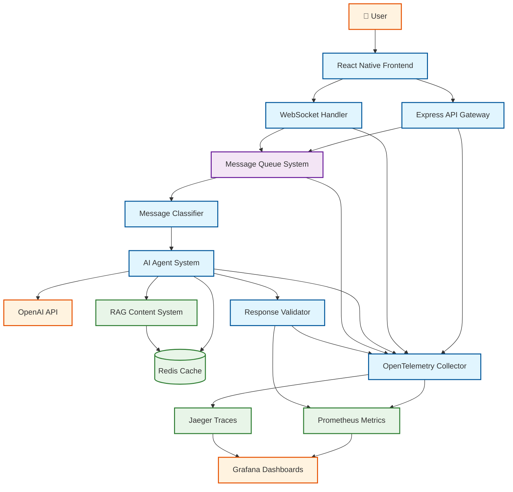
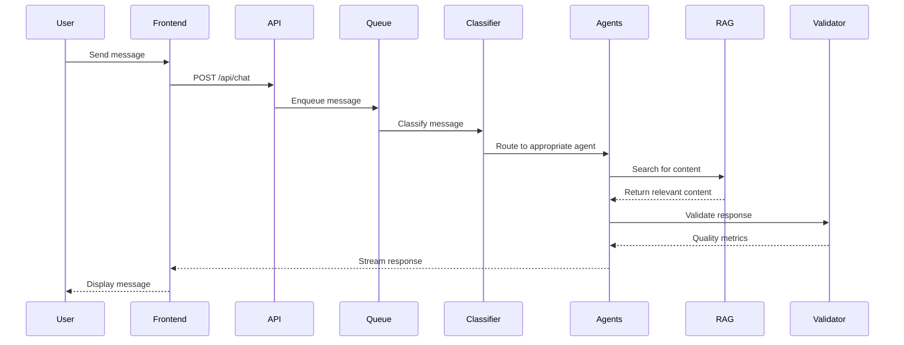
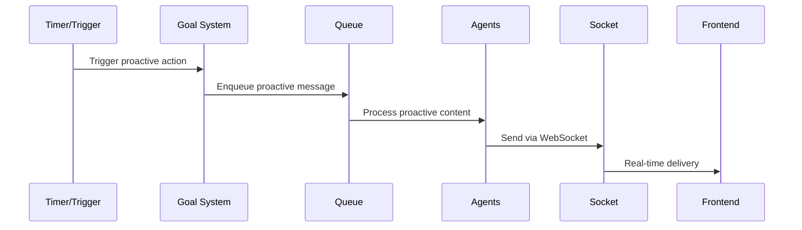
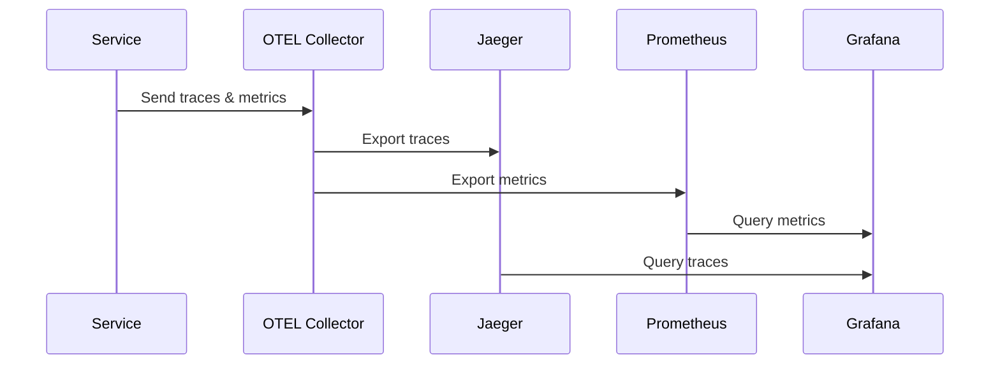

# System Overview

This document provides a high-level overview of the AI Goal-Seeking System architecture, outlining core components, data flows, and system responsibilities.

## Architecture Context

This AI Goal-Seeking System demonstrates enterprise-grade architecture patterns with emphasis on:

- **Quality Assurance** - Comprehensive validation and monitoring
- **Observability** - End-to-end tracing, metrics, and logging
- **Scalability** - Modular, loosely-coupled component design
- **Reliability** - Queue-based processing with retry logic and dead letter queues

## High-Level Architecture

## Core Components

### Frontend Layer
- **[React Native Frontend](./components/frontend.md)** - Cross-platform mobile and web interface with real-time chat capabilities

### API & Communication Layer
- **[Express API Gateway](./components/backend.md)** - RESTful API endpoints, request routing, and business logic
- **WebSocket Handler** - Real-time bidirectional communication for chat and proactive messaging

### Processing & Intelligence Layer
- **[Message Queue System](./components/message-queue.md)** - Asynchronous message processing with priority, retry logic, and dead letter queues
- **Message Classifier** - Intelligent routing of user messages to appropriate agent types
- **[AI Agent System](./components/agents.md)** - Multi-agent orchestration with specialized agents for different domains

### Content & Data Layer
- **[RAG System](./components/rag-system.md)** - Curated content retrieval with quality ratings and intelligent search
- **Redis Cache** - High-performance caching for session data, agent state, and content

### Quality Assurance
- **[Response Validator](./components/validation-system.md)** - Comprehensive quality scoring and issue detection for AI responses

### Observability Stack
- **OpenTelemetry Collector** - Centralized telemetry collection and processing
- **Prometheus Metrics** - Time-series metrics storage and alerting
- **Jaeger Traces** - Distributed request tracing and performance analysis
- **Grafana Dashboards** - Visual monitoring and analytics interface

## Key Data Flows

### 1. User Request Flow

### 2. Proactive Messaging Flow

### 3. Observability Flow

## System Characteristics

### Performance
- **Response Time**: < 2s for most agent responses
- **Throughput**: Supports concurrent users via queue-based processing
- **Scalability**: Horizontal scaling via stateless services and Redis clustering

### Reliability
- **Queue Durability**: Messages persisted with retry logic
- **Dead Letter Queues**: Failed message handling and analysis
- **Circuit Breakers**: External API failure resilience

### Observability
- **Distributed Tracing**: End-to-end request visibility
- **Metrics Collection**: Business and system metrics
- **Quality Monitoring**: AI response validation and scoring
- **Real-time Dashboards**: System health and performance visualization

## Integration Points

### External Services
- **OpenAI API**: GPT model integration for dynamic responses
- **Redis**: Caching and session management
- **Grafana**: Monitoring and alerting

### Internal Services
All components communicate via:
- **Message Queue**: Asynchronous, reliable message passing
- **REST APIs**: Synchronous service-to-service communication
- **WebSockets**: Real-time client updates
- **OpenTelemetry**: Distributed tracing correlation

## Development Philosophy

This system demonstrates several key architectural principles:

1. **Separation of Concerns** - Each component has a single, well-defined responsibility
2. **Loose Coupling** - Components interact via well-defined interfaces and queues
3. **Observable by Design** - Every interaction is traced and measured
4. **Quality First** - AI responses are validated before delivery
5. **Resilient Processing** - Failures are handled gracefully with retry logic

## Related Documentation

- **Getting Started**: [Setup and Configuration](../getting-started/index.md)
- **Component Details**: [Architecture Components](./components/agents.md)
- **Operations**: [Monitoring and Observability](../operations/observability.md)
- **API Reference**: [Endpoint Documentation](../reference/api-reference.md)
- **Examples**: [Integration Examples](../examples/code-samples.md)
