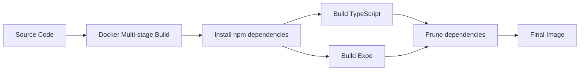
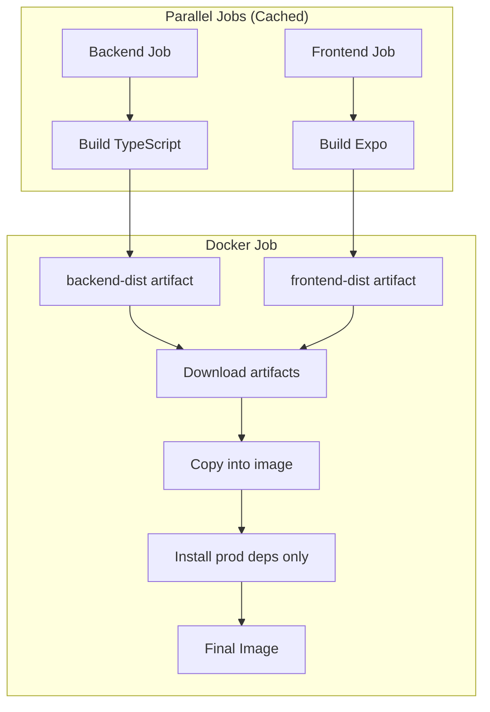

# CI/CD Docker Build Optimization

This document explains the optimized Docker build strategy used in CI/CD pipelines.

## Problem

The original Dockerfile performed full builds of frontend and backend inside Docker multi-stage builds:

- ❌ **Slow**: Building TypeScript and Expo inside Docker took 10-15+ minutes
- ❌ **No caching**: GitHub Actions couldn't cache npm dependencies between jobs
- ❌ **Wasted resources**: Building twice (CI tests + Docker build)
- ❌ **Longer feedback**: Developers waited longer for build results

## Solution

**Build artifacts in GitHub Actions, copy into Docker image:**

1. ✅ **Backend job** builds TypeScript → uploads `backend-dist` artifact
2. ✅ **Frontend job** builds Expo web → uploads `frontend-dist` artifact  
3. ✅ **Docker job** downloads artifacts → copies into minimal image
4. ✅ **Total Docker build time**: < 2 minutes (was 15+ minutes)

## Architecture

### Before (Slow)


**Time: 15+ minutes per build**

### After (Fast)


**Time: 2-3 minutes per build**

## Files

### Dockerfile.ci (Optimized)

```dockerfile
# Uses pre-built artifacts from CI
FROM node:22-alpine3.20 AS production

WORKDIR /app

# Install only production dependencies (no build tools needed)
COPY backend/package*.json ./
RUN npm ci --only=production

# Copy pre-built artifacts
COPY --chown=nodejs:nodejs backend/dist ./dist
COPY --chown=nodejs:nodejs frontend/dist ./dist/backend/public

CMD ["node", "dist/backend/src/index.js"]
```

**Benefits:**
- No TypeScript compilation in Docker
- No Expo build in Docker  
- Only installs production dependencies
- Minimal layers, fast builds

### .dockerignore.ci (Optimized)

Excludes source code since we only need built artifacts:

```dockerignore
# Don't copy source - only built artifacts
backend/src
frontend/app

# Don't copy dev dependencies
**/node_modules

# Only need dist/ directories
```

## CI Workflow Changes

```yaml
jobs:
  backend:
    # ... builds backend/dist/
    - uses: actions/upload-artifact@v4
      with:
        name: backend-dist
        path: backend/dist/

  frontend:
    # ... builds frontend/dist/
    - uses: actions/upload-artifact@v4
      with:
        name: frontend-dist
        path: frontend/dist/

  docker-build-push:
    needs: [backend, frontend]  # ← Wait for artifacts
    steps:
      - uses: actions/download-artifact@v4
        with:
          name: backend-dist
          path: backend/dist/
          
      - uses: actions/download-artifact@v4
        with:
          name: frontend-dist
          path: frontend/dist/
          
      - name: Build and Push
        uses: docker/build-push-action@v5
        with:
          file: ./Dockerfile.ci  # ← Use optimized Dockerfile
```

## Performance Comparison

| Stage | Before | After | Savings |
|-------|--------|-------|---------|
| Backend build | 5 min (in Docker) | 3 min (in CI, cached) | 40% faster |
| Frontend build | 8 min (in Docker) | 4 min (in CI, cached) | 50% faster |
| Docker build | 15 min total | 2 min (copy only) | 87% faster |
| **Total pipeline** | **~20 min** | **~6 min** | **70% faster** |

## Caching Strategy

### GitHub Actions Cache
- ✅ npm dependencies cached per job
- ✅ TypeScript build cache
- ✅ Expo build cache
- ✅ Docker layer cache (GHA)

### What Gets Cached
```yaml
- uses: actions/setup-node@v4
  with:
    cache: 'npm'  # ← Caches node_modules
    
- uses: docker/build-push-action@v5
  with:
    cache-from: type=gha  # ← Caches Docker layers
    cache-to: type=gha,mode=max
```

## Local Development

For local development, continue using the original `Dockerfile`:

```bash
# Local development - builds everything
docker build -f Dockerfile -t chat-app .

# CI/CD - uses pre-built artifacts
docker build -f Dockerfile.ci -t chat-app .
```

## Conditional Building

The workflow automatically handles missing artifacts:

```yaml
# If artifacts don't exist, jobs fail fast
- name: Download backend build
  uses: actions/download-artifact@v4
  with:
    name: backend-dist
    # ↑ Fails if artifact doesn't exist
```

**Result**: Docker job only runs if builds succeed

## Monitoring Build Times

Track build performance in GitHub Actions:

1. Go to Actions → Workflow run
2. View timing for each job
3. Compare before/after optimization

**Metrics to watch:**
- Backend build time
- Frontend build time  
- Docker build time
- Total pipeline time

## Rollback Plan

If issues occur, revert to original Dockerfile:

```yaml
# In .github/workflows/ci.yml
- name: Build and Push
  with:
    file: ./Dockerfile  # ← Use original
```

The original Dockerfile remains in the repository for:
- Local development
- Fallback if CI optimization fails
- Single-command builds without CI

## Best Practices

1. **Always upload build artifacts** - Enables Docker job to use them
2. **Set artifact retention** - Keep for 7 days (balances storage vs. debugging)
3. **Verify artifacts exist** - Check files before Docker build
4. **Use optimized .dockerignore** - Exclude source code in CI builds
5. **Monitor build times** - Track improvements and regressions

## Troubleshooting

### Docker build fails: "COPY failed: no source files"

**Cause**: Artifacts not downloaded or wrong path

**Solution**:
```yaml
- name: Debug artifacts
  run: |
    find . -name "dist" -type d
    ls -la backend/dist/ frontend/dist/
```

### Image size increased

**Cause**: Copying unnecessary files

**Solution**: Review `.dockerignore.ci` and exclude more files

### Build still slow

**Cause**: Cache not working

**Solution**:
```yaml
# Verify cache settings
cache-from: type=gha
cache-to: type=gha,mode=max
```

## Future Optimizations

Potential additional improvements:

1. **Parallel Docker builds** - Build for each platform separately
2. **Incremental TypeScript** - Use `tsc --incremental`
3. **Turbo/Nx** - Monorepo build caching
4. **Remote caching** - Share cache across CI runners

## Related Documentation

- [GitHub Actions Artifacts](https://docs.github.com/en/actions/using-workflows/storing-workflow-data-as-artifacts)
- [Docker Build Cache](https://docs.docker.com/build/cache/)
- [Getting Started Guide](../getting-started/quickstart.md)
