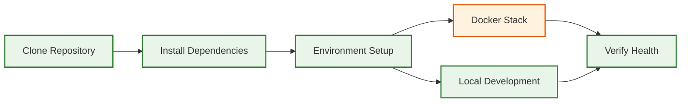

# Getting Started

Welcome to the AI Goal-Seeking System! This section provides everything you need to get up and running quickly, whether you're a new contributor, reviewer, or demo participant.

## Quick Navigation

### 🚀 New to the Project?
- **[Quickstart Guide](./quickstart.md)** - 10-minute setup to run the demo and explore the architecture
- **[Development Setup](./setup.md)** - Comprehensive setup guide for local development and demo environments
- **[Troubleshooting](./troubleshooting.md)** - Common issues and solutions during setup and development

## Prerequisites

Before getting started, ensure you have:

- **Node.js 18+** and npm (or yarn)
- **Docker** (optional but recommended)
- **Git** for version control
- **Platform**: macOS, Linux, or Windows

## Quick Setup Overview



### Fast Track (Docker)
```bash
# Clone and run with Docker
git clone https://github.com/ianlintner/React.git
cd React
docker-compose up -d
```

### Local Development
```bash
# Backend
cd backend && npm install && npm run dev

# Frontend (separate terminal)
cd frontend && npm install && npm start
```

## What's Next?

After setup, explore these key areas:

1. **System Architecture** - Understanding the [system design](../architecture/index.md) and components
2. **API Documentation** - Interactive Swagger UI at `http://localhost:5001/docs`
3. **Operations** - [Monitoring and observability](../operations/observability.md) tools
4. **Examples** - [Integration examples](../examples/code-samples.md) and code samples

## Getting Help

- **Issues**: Check [troubleshooting guide](./troubleshooting.md) for common problems
- **Architecture**: Review [system overview](../architecture/system-overview.md) for context
- **API**: Explore live endpoints in [API reference](../reference/api-reference.md)

## Related Documentation

- [System Architecture](../architecture/index.md)
- [Operations Guide](../operations/observability.md)
- [API Reference](../reference/api-reference.md)
- [Docker Setup Details](../reference/docker-setup.md)
- [Code Quality Standards](../reference/code-quality.md)
