# Quickstart Guide

**10-minute guide to get the AI Chat Application running locally and explore its capabilities.**

## Overview

This quickstart guide will get you up and running with the complete AI chat system in under 10 minutes. You'll deploy both the backend services and mobile frontend, then explore the key features and architecture.

**Target Audience:** New contributors, reviewers, demo participants, and evaluators  
**Prerequisites:** Docker or Node.js 18+, npm/yarn, Git, mobile device or emulator

## Quick Start Options

### Option 1: Docker (Recommended)

The fastest way to run the complete system with all services:

```bash
# Clone and navigate to project
git clone <repository-url>
cd <project-directory>

# Start all services with Docker
docker-compose up -d

# Verify services are running
docker-compose ps
```

**Services Started:**

- 🚀 Backend API server: `http://localhost:5001`
- 📊 Prometheus metrics: `http://localhost:9090`
- 📈 Grafana dashboards: `http://localhost:3000`
- 🔍 Jaeger tracing: `http://localhost:16686`

### Option 2: Local Development

For active development and debugging:

```bash
# Terminal 1: Backend
cd backend
npm install
npm run dev
# ✅ Backend running on http://localhost:5001

# Terminal 2: Frontend (React Native/Expo)
cd frontend
npm install
npm start
# ✅ Expo Dev Tools opens in browser
# 📱 Use Expo Go app to scan QR code
```

## System Verification

### 1. Backend Health Checks

```bash
# API Health Check
curl http://localhost:5001/api/health

# Expected Response:
# {
#   "status": "OK",
#   "timestamp": "2024-01-01T12:00:00.000Z",
#   "version": "1.0.0"
# }

# View API Documentation
open http://localhost:5001/docs  # Interactive Swagger UI
```

### 2. Frontend Verification

**Mobile App (Expo):**

- Open Expo Go app on your mobile device
- Scan QR code from terminal/browser
- App should load with chat interface

**Web Browser (for testing):**

- Expo Dev Tools: `http://localhost:19002`
- Web version: Press `w` in terminal

### 3. Real-time Features Test

**Chat Functionality:**

1. Send a message in the mobile app
2. Observe real-time streaming response
3. Check agent classification (General, Joke, Trivia, etc.)
4. View proactive messages from the goal-seeking system

**Monitoring & Observability:**

1. **Grafana Dashboards:** `http://localhost:3000`
   - Username: `admin`, Password: `admin`
   - View AI validation metrics and system health

2. **Prometheus Metrics:** `http://localhost:9090`
   - Query validation metrics: `validation_pass_total`
   - Monitor response times: `http_request_duration_seconds`

3. **Jaeger Tracing:** `http://localhost:16686`
   - View distributed traces for chat requests
   - Analyze agent processing performance

## Key Features Demo

### 1. Multi-Agent Intelligence

```bash
# Test different agent types by sending these messages:

# Joke Agent
"Tell me a funny joke"

# Trivia Agent  
"What's an interesting fact about space?"

# Technical Support Agent
"I'm having trouble with my account login"

# GIF Agent
"Show me a celebration gif"

# D&D Master
"Generate a D&D character"
```

### 2. Real-time Validation Dashboard

Navigate to the **Dashboard** tab in the mobile app to see:
- 📊 Response quality scores
- 🤖 Agent performance metrics  
- ⏱️ Response time analytics
- 📈 Quality trends over time

### 3. Enterprise Observability

**Grafana Dashboard Navigation:**
1. **AI Validation Overview:** System-wide validation metrics
2. **AI Validation Quality:** Detailed quality analysis
3. **System Health:** Infrastructure monitoring

**Key Metrics to Explore:**
- Message processing rates
- Agent accuracy scores  
- Response validation pass/fail rates
- System performance indicators

## Architecture Quick Tour

### System Components

```mermaid
graph LR
    Mobile[📱 Mobile App<br/>React Native] --> Backend[🚀 Backend API<br/>Node.js + Express]
    Backend --> Queue[📋 Message Queue<br/>Priority processing]
    Backend --> Agents[🤖 AI Agents<br/>Multi-agent system]
    Backend --> Validation[✅ Validation<br/>Response quality]
    Backend --> Metrics[📊 Metrics<br/>Prometheus]
    Metrics --> Grafana[📈 Grafana<br/>Dashboards]
    Backend --> Tracing[🔍 Tracing<br/>Jaeger]
```



**Key Technologies:**
- **Frontend:** React Native + Expo for cross-platform mobile
- **Backend:** Node.js + Express + TypeScript for API services
- **Real-time:** Socket.io for WebSocket communication
- **AI Integration:** OpenAI GPT-4 with intelligent agent routing
- **Observability:** OpenTelemetry + Prometheus + Grafana + Jaeger
- **Validation:** Custom AI response quality assurance system

### Data Flow Overview

1. **User Input:** Message sent from mobile app
2. **Classification:** AI agent classifier determines appropriate handler
3. **Processing:** Specialized agent generates contextual response
4. **Validation:** Quality assurance system scores response
5. **Delivery:** Real-time streaming to mobile interface
6. **Monitoring:** Metrics and traces captured for analysis

## Next Steps

### 🏗️ Development Setup
For detailed development environment setup:
**→ [Complete Setup Guide](./setup.md)**

### 🔧 Troubleshooting  
If you encounter issues during quickstart:
**→ [Troubleshooting Guide](./troubleshooting.md)**

### 🏛️ System Architecture
To understand the system design in depth:
**→ [Architecture Overview](../architecture/index.md)**

###
