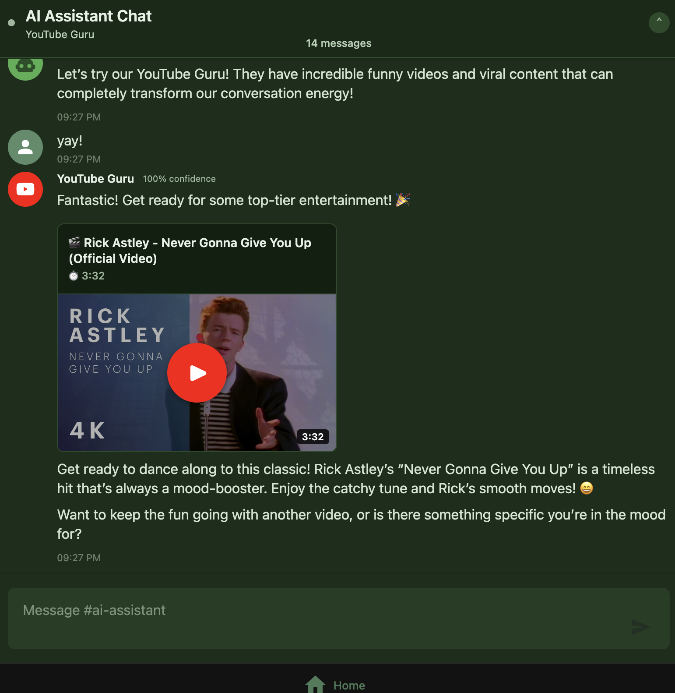

# Project Documentation

Welcome to the project documentation. This site is structured for Backstage TechDocs using MkDocs.

## Quick Start

- Quickstart: getting-started/quickstart.md
- Setup: getting-started/setup.md
- Troubleshooting: getting-started/troubleshooting.md

## Table of Contents

- Getting Started
  - Quickstart: getting-started/quickstart.md
  - Setup: getting-started/setup.md
  - Troubleshooting: getting-started/troubleshooting.md

- Architecture
  - System Overview: architecture/system-overview.md
  - Architecture Guide: architecture/architecture.md
  - Components
    - Agents: architecture/components/agents.md
    - Backend: architecture/components/backend.md
    - Frontend: architecture/components/frontend.md
    - Message Queue: architecture/components/message-queue.md
    - RAG System: architecture/components/rag-system.md
    - Validation System: architecture/components/validation-system.md

- Operations
  - CI/CD: operations/ci-cd.md
  - Observability: operations/observability.md
  - Prometheus & Grafana: operations/prometheus-grafana.md
  - Tracing: operations/tracing.md

- Reference
  - API Reference: reference/api-reference.md
  - Code Quality: reference/code-quality.md
  - Docker Setup: reference/docker-setup.md
  - Test Bench: reference/test-bench.md
  - Test Bench OpenAPI: reference/test-bench-openapi.yaml
  - YouTube Embedding: reference/youtube-embedding.md

- Examples
  - External App: examples/external-app.md

- Additional Resources
  - System Summary: system-summary.md
  - Backend (legacy): backend.md
  - API Reference (legacy): api-reference.md
  - Architecture (root doc): architecture.md
  - Docs README: README.md
  - IA Proposal: IA-PROPOSAL.md
  - Consolidation Plan: CONSOLIDATION-PLAN.md
  - Prometheus Grafana Migration: prometheus-grafana-migration.md
  - Docs Inventory (CSV): docs-inventory.csv

## How to View These Docs

- Local MkDocs preview:
  1. Install MkDocs: pip install mkdocs
  2. Serve locally from repo root: mkdocs serve
  3. Open http://127.0.0.1:8000

- Backstage TechDocs:
  - Ensure your Backstage instance is configured for TechDocs.
  - Register the component using catalog-info.yaml at the repo root (see below).
  - Open the registered entity in Backstage and navigate to Docs.

## Contributing

- Follow style and structure consistent with the sections above.
- Add new pages under the relevant folder (getting-started, architecture, operations, reference, examples).
- Update mkdocs.yml to include new pages in the navigation if needed.
