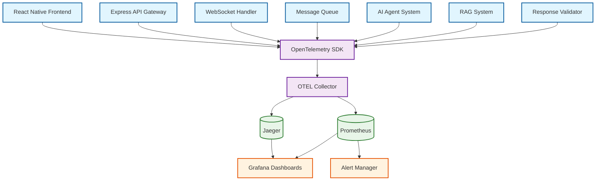
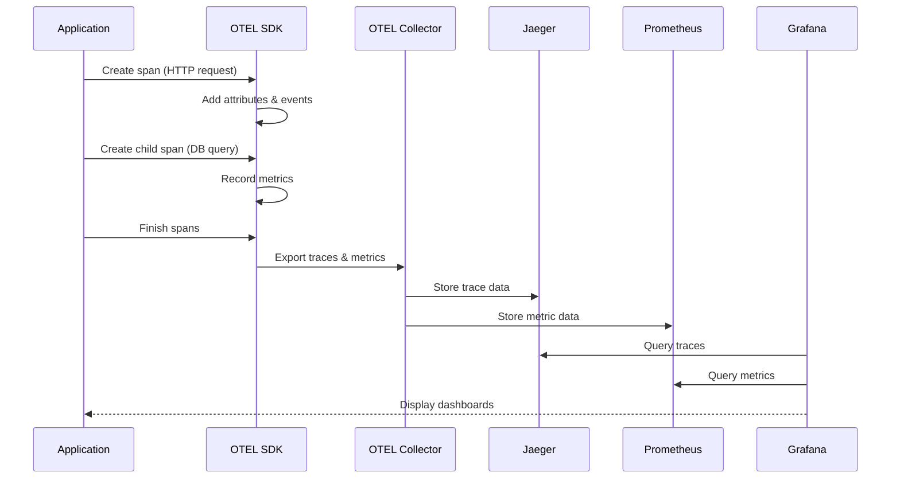
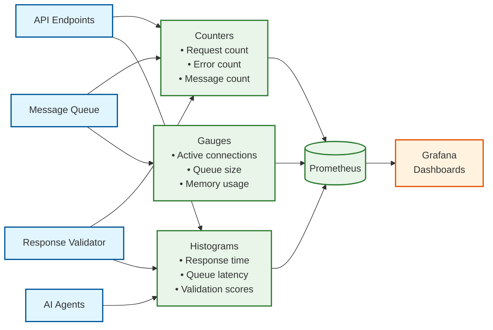
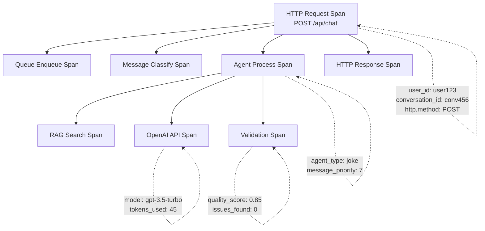

# Observability & Monitoring

Comprehensive end-to-end observability stack providing distributed tracing, metrics collection, and real-time monitoring for the AI Goal-Seeking System.

## Overview

The observability stack includes:

- **Distributed Tracing** - OpenTelemetry instrumentation with Jaeger backend
- **Metrics Collection** - Prometheus for time-series metrics and alerting
- **Dashboards** - Grafana for visualization and monitoring
- **Structured Logging** - Centralized logging with correlation IDs
- **AI Quality Monitoring** - Response validation metrics and quality scoring

## Architecture

### OpenTelemetry Pipeline



### Telemetry Data Flow



### Metrics Collection Architecture



## Key Metrics

### Business Metrics

#### AI Agent Performance
- `agent_requests_total` - Total requests by agent type
- `agent_response_duration_seconds` - Response time distribution
- `agent_errors_total` - Error count by agent and error type
- `agent_tokens_used_total` - Token consumption by agent

#### Validation Quality
- `validation_score_histogram` - Quality score distribution
- `validation_issues_total` - Issues by type and severity
- `validation_pass_rate` - Percentage of responses passing validation

#### Queue Performance
- `queue_messages_total` - Messages processed by queue and priority
- `queue_processing_duration_seconds` - Message processing time
- `queue_size_current` - Current queue depth
- `queue_dead_letters_total` - Failed messages by queue

### System Metrics

#### HTTP Performance
- `http_requests_total` - Request count by method, route, status
- `http_request_duration_seconds` - Request latency distribution
- `http_concurrent_connections` - Active WebSocket connections

#### Resource Usage
- `process_cpu_seconds_total` - CPU usage
- `process_resident_memory_bytes` - Memory consumption
- `nodejs_heap_size_used_bytes` - Node.js heap usage

## Grafana Dashboards

### AI Validation Overview Dashboard

**Location**: `grafana/dashboards/ai-validation-overview.json`

**Key Panels**:
- Total validations processed
- Success rate by agent type
- Average quality scores
- Issues breakdown by severity

### AI Validation Quality Dashboard

**Location**: `grafana/dashboards/ai-validation-quality.json`

**Key Panels**:
- Quality metrics by agent (readability, accuracy, coherence)
- Response length distribution
- Issue trends over time
- Proactive vs regular validation rates

### System Performance Dashboard

**Key Panels**:
- Request rate and latency
- Queue processing metrics
- Error rates and types
- Resource utilization

## Distributed Tracing

### Trace Structure



### Trace Correlation

All traces include correlation IDs:
- `user_id` - User identifier
- `conversation_id` - Conversation context
- `message_id` - Unique message identifier
- `agent_type` - AI agent handling the request
- `session_id` - User session context

## Configuration

### OpenTelemetry Collector

**Location**: `otel-collector-config.yaml`

**Key Components**:
- **Receivers**: OTLP (gRPC and HTTP)
- **Processors**: Batch processing, resource detection
- **Exporters**: Jaeger (traces), Prometheus (metrics)

```yaml
receivers:
  otlp:
    protocols:
      grpc:
        endpoint: 0.0.0.0:4317
      http:
        endpoint: 0.0.0.0:4318

processors:
  batch:
    timeout: 1s
    send_batch_size: 1024
  resource:
    attributes:
      - key: service.name
        from_attribute: service.name
        action: upsert

exporters:
  jaeger:
    endpoint: jaeger:14250
    tls:
      insecure: true
  prometheus:
    endpoint: "0.0.0.0:8889"

service:
  pipelines:
    traces:
      receivers: [otlp]
      processors: [resource, batch]
      exporters: [jaeger]
    metrics:
      receivers: [otlp]
      processors: [resource, batch]
      exporters: [prometheus]
```

### Grafana Provisioning

**Datasource Configuration**: `grafana/provisioning/datasources/prometheus.yml`

```yaml
apiVersion: 1
datasources:
  - name: Prometheus
    type: prometheus
    access: proxy
    url: http://prometheus:9090
    isDefault: true
  - name: Jaeger
    type: jaeger
    access: proxy
    url: http://jaeger:16686
```

**Dashboard Configuration**: `grafana/provisioning/dashboards/dashboards.yml`

```yaml
apiVersion: 1
providers:
  - name: 'ai-validation'
    folder: 'AI Validation'
    type: file
    path: /etc/grafana/provisioning/dashboards
    updateIntervalSeconds: 30
```

## Development Setup

### Local Docker Stack

```bash
# Start full observability stack
docker-compose up -d

# Services available:
# - Grafana: http://localhost:3000 (admin/admin)
# - Jaeger UI: http://localhost:16686
# - Prometheus: http://localhost:9090
```

### Environment Variables

```bash
# Enable tracing
OTEL_EXPORTER_OTLP_ENDPOINT=http://localhost:4318
OTEL_SERVICE_NAME=ai-chat-backend
OTEL_RESOURCE_ATTRIBUTES=service.version=1.0.0

# Metrics configuration
PROMETHEUS_PORT=9090
METRICS_ENABLED=true

# Logging
LOG_LEVEL=info
LOG_FORMAT=json
```

## Monitoring Playbooks

### High Response Latency

**Detection**: Response time P95 > 2 seconds

**Investigation**:
1. Check Grafana dashboard for latency spikes
2. Query Jaeger for slow traces
3. Identify bottleneck services (OpenAI API, queue processing)
4. Review error logs for correlation

**Mitigation**:
- Scale queue processors
- Implement circuit breakers
- Add response caching

### Validation Quality Issues

**Detection**: Validation pass rate < 90%

**Investigation**:
1. Review validation dashboard for failing agents
2. Check issue types and severity distribution
3. Analyze recent changes to agent prompts
4. Review dead letter queue for failed validations

**Mitigation**:
- Adjust validation thresholds
- Improve agent prompts
- Add specialized validation rules

### Queue Backlog

**Detection**: Queue depth > 100 messages

**Investigation**:
1. Check queue processing rates
2. Identify slow message types
3. Review processor error rates
4. Check Redis/memory usage

**Mitigation**:
- Scale message processors
- Increase queue workers
- Optimize slow handlers

## Best Practices

### Instrumentation

- **Trace Everything**: Instrument all service boundaries
- **Structured Attributes**: Use consistent attribute naming
- **Correlation Context**: Propagate user and conversation IDs
- **Error Enrichment**: Add detailed error context to spans

### Metrics Design

- **Business Metrics First**: Focus on user-facing metrics
- **Consistent Labels**: Use standardized label names
- **Appropriate Cardinality**: Avoid high-cardinality labels
- **Dashboard Hierarchy**: Start with high-level, drill down to details

### Performance

- **Sampling Strategy**: Use head-based sampling in production
- **Batch Processing**: Configure appropriate batch sizes
- **Resource Limits**: Set memory and CPU limits for collectors
- **Data Retention**: Configure appropriate retention policies

## Troubleshooting

### Common Issues

**Missing Traces**:
- Verify OTEL collector endpoint
- Check service instrumentation
- Review sampling configuration
- Validate network connectivity

**High Metrics Cardinality**:
- Review label usage
- Implement label filtering
- Use metric aggregation
- Monitor Prometheus memory usage

**Dashboard Loading Issues**:
- Check Grafana datasource configuration
- Verify Prometheus query syntax
- Review dashboard JSON for errors
- Check network connectivity

### Debugging Commands

```bash
# Check OTEL collector health
curl http://localhost:13133/

# Verify Prometheus targets
curl http://localhost:9090/api/v1/targets

# Test trace export
curl -X POST http://localhost:4318/v1/traces \
  -H "Content-Type: application/json" \
  -d '{"resourceSpans": []}'

# Check Jaeger traces
curl "http://localhost:16686/api/traces?service=ai-chat-backend"
```

## Related Documentation

- [Tracing Configuration](./tracing.md)
- [Prometheus & Grafana Migration](./prometheus-grafana.md)
- [System Architecture](../architecture/system-overview.md)
- [Docker Setup](../reference/docker-setup.md)
